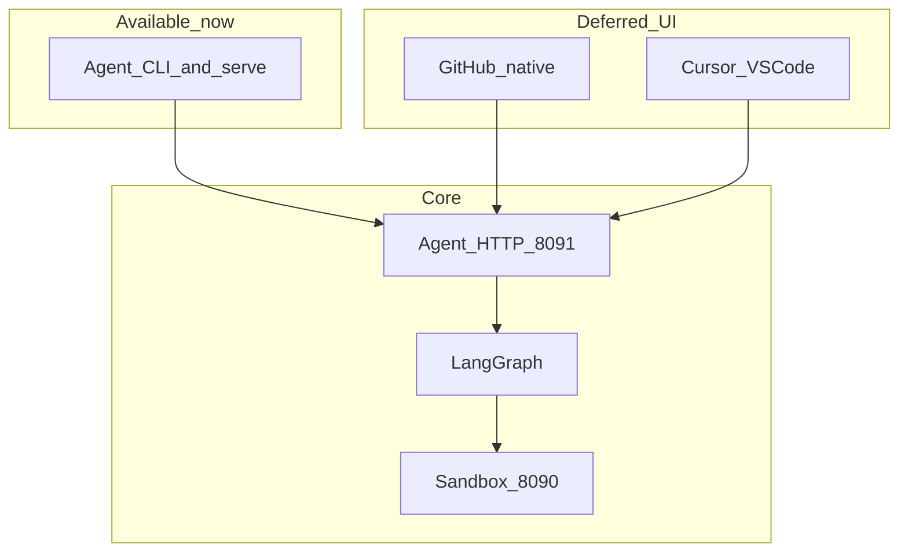

# Raphael Interface Layer

**Status:** Direction accepted · I0 HTTP **served** · **IDE P0 shipped** (VSIX) · GitHub-native UI deferred  
**Interactive path today:** [CLI → `Usage.md`](Usage.md) · [IDE → `IDE/README.md`](IDE/README.md)  
**I0 API lock:** [`prd-i0-api.md`](prd-i0-api.md)  
**Decisions:** [`D-20260810-16`](../decision.md), [`D-20260811-01`](../decision.md), [`D-20260811-02`](../decision.md), [`D-20260811-03`](../decision.md)

---

## What this folder is

`interface/` is the **human-facing product layer** for Raphael. It sits *above* the agent and *beside* GitHub/Cursor — never inside the sandbox controller.

| Layer | Path | Job |
|-------|------|-----|
| Sandbox | `sandbox/` | Reproduce & validate failures in isolation |
| Agent | `agent/` | Ingest → diagnose → patch → draft PR / issue snippet (+ future I0 actions / GitHub commands) |
| **Interface** | **`interface/`** | **How humans steer, inspect, apply, and give feedback** |

Until GitHub-native UX and the IDE package ship, **operators use the agent CLI and HTTP API** documented in [`Usage.md`](Usage.md). Those CLIs are **interface v0**; every planned UI action maps to one of them (or to an I0 API once implemented).

---

## Documents in this tree

| File | Purpose |
|------|---------|
| [`README.md`](README.md) | This overview — features, architecture, roadmap |
| [`Usage.md`](Usage.md) | **How to use Raphael interactively via CLI (now)** |
| [`prd.md`](prd.md) | Umbrella PRD — shared principles + locked decisions |
| [`prd-i0-api.md`](prd-i0-api.md) | **I0** endpoints, auth, escalate FSM, `delivery_patch`, correlation |
| [`github-native/prd.md`](github-native/prd.md) | GitHub Issues/PRs/Checks slash-command product spec |
| [`IDE/prd.md`](IDE/prd.md) | Cursor / VS Code extension product spec |
| [`IDE/README.md`](IDE/README.md) | **Install VSIX + use the P0 extension** |

```text
interface/
├── README.md
├── Usage.md
├── prd.md
├── prd-i0-api.md
├── github-native/
│   └── prd.md
└── IDE/
    └── prd.md
```

Wire schemas (not served yet): `contracts/agent/run_list_response.json`, `run_create_*.json`, `run_action_*.json`.

---

## Product vision

Raphael already delivers remediation as **draft PRs** (Route A) and **issue fix snippets** (Route B). The interface layer makes those outcomes **interactive**:

1. **See** a run’s diagnosis, evidence, sandbox `result_id`, and delivery URL.  
2. **Steer** — retry, escalate, cancel, or start a safe diagnosis — without changing production.  
3. **Act** — apply a Route B snippet in the editor, or jump to the draft PR.  
4. **Learn** — record accepted / rejected / merged / deploy outcomes for offline learning.

Hard product promise (all surfaces, including CLI):

- No auto-merge  
- No production cluster writes  
- No direct calls to the sandbox HTTP API from human UI clients  
- Agent guardrails stay authoritative  

---

## Locked decisions (summary)

| Topic | Lock |
|-------|------|
| Agent listen | `127.0.0.1:8091` |
| Auth | Non-loopback requires `RAPHAEL_INTERFACE_TOKEN` bearer |
| Commands | `/raphael feedback accepted\|rejected\|edited` (no `/raphael accept`) |
| Command host | Agent (`RAPHAEL_GITHUB_COMMANDS=0` default) |
| ACL | write: status/help/feedback; privileged team: retry/diagnose/fix/escalate/cancel |
| Checks | Advisory; conclusion **`neutral`** by default |
| IDE I2 | Local agent only |
| IDE git P0 | Open draft PR URL only; no auto-push |
| GitHub App | Single App for pilot |
| Patch apply | `delivery_patch` resolution in I0 |

---

## Surfaces

### 1. CLI (available now — interface v0)

Full walkthrough: **[`Usage.md`](Usage.md)**.

| Capability | How (today) |
|------------|-------------|
| Safe preflight | `pilot_go_nogo` / `pilot_local_preflight` |
| End-to-end dry-run remediation | `demo_partner` |
| Live or stub sandbox smoke | `smoke` |
| HTTP webhooks + run GET | `raphael-agent-serve` (`:8091`) |
| Human feedback (FR-065) | `record_feedback` |
| Operator metrics | `metrics` |
| Offline learning snapshot | `learn` + `RAPHAEL_LEARNING=1` |

### 2. GitHub-native (planned — PRD)

| Area | Features |
|------|----------|
| **Slash commands** | `/raphael status`, `retry`, `escalate`, `cancel`, `feedback …`, `diagnose`, `fix`, `help` |
| **Auto comments** | Terminal posts with `run_id` + mode + correlation markers |
| **Labels** | `raphael:fix` + draft/escalated/needs-human |
| **Checks** | Advisory Check Run; **`neutral`** by default; never required for merge |
| **Safety** | Partner gates, rate limits, idempotent `action_id`, audit |

### 3. IDE / Cursor plugin (P0 shipped)

See [`IDE/README.md`](IDE/README.md). Install via VSIX; Runs panel, Apply Fix, Open Draft PR, Feedback.

ChatOps (Slack/Teams) is **not** in this folder — root [`prd.md`](../prd.md) §25.

---

## Architecture



**Rule:** Interfaces never talk to `RAPHAEL_SANDBOX_URL`. Only the agent does.

---

## Delivery phases

| Phase | Focus | Exit |
|-------|--------|------|
| **I0** | Contracts (docs+schemas done; HTTP next) | [`prd-i0-api.md`](prd-i0-api.md) |
| **I1** | GitHub-native P0 commands in agent | Partner `/raphael …` |
| **I2** | IDE P0 vs local agent | Apply fix + feedback |
| **I3** | Advisory Checks | `neutral` default |
| **I4** | IDE decorations / branch opt-in | |
| **I5** | Non-loopback auth, harden | Permission-matrix |

---

## Related docs

| Doc | Why |
|-----|-----|
| [`Usage.md`](Usage.md) | CLI operator manual |
| [`prd-i0-api.md`](prd-i0-api.md) | Action API lock |
| [`../agent/README.md`](../agent/README.md) | Agent setup |
| [`../docs/permission-matrix.md`](../docs/permission-matrix.md) | May / may not |
| [`../handoff.md`](../handoff.md) | Team context |

**Use Raphael today:** open [`Usage.md`](Usage.md).
