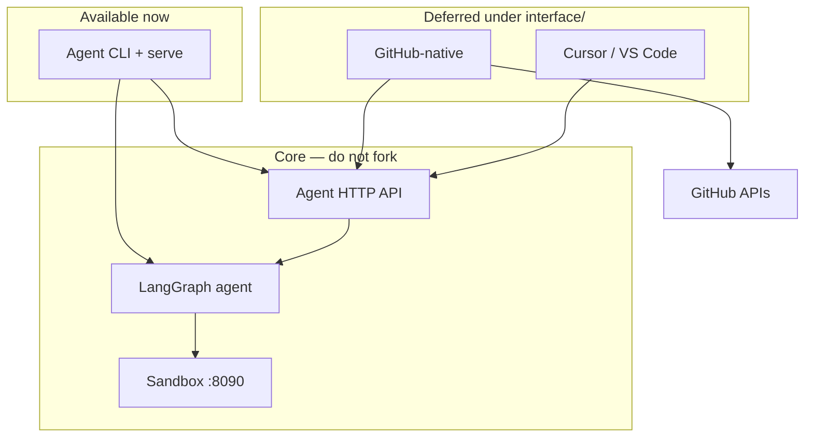

# Raphael Interface Layer

**Status:** Product requirements locked · **implementation deferred**  
**Interactive path today:** [CLI usage guide → `Usage.md`](Usage.md)  
**Decision:** [`D-20260810-16`](../decision.md)

---

## What this folder is

`interface/` is the **human-facing product layer** for Raphael. It sits *above* the agent and *beside* GitHub/Cursor — never inside the sandbox controller.

| Layer | Path | Job |
|-------|------|-----|
| Sandbox | `sandbox/` | Reproduce & validate failures in isolation |
| Agent | `agent/` | Ingest → diagnose → patch → draft PR / issue snippet |
| **Interface** | **`interface/`** | **How humans steer, inspect, apply, and give feedback** |

Until GitHub-native and IDE packages ship, **operators use the agent CLI and HTTP API** documented in [`Usage.md`](Usage.md). Those CLIs are the temporary “interface,” and every planned UI action maps to one of them (or to a small API addition in phase I0).

---

## Documents in this tree

| File | Purpose |
|------|---------|
| [`README.md`](README.md) | This overview — features, architecture, roadmap |
| [`Usage.md`](Usage.md) | **How to use Raphael interactively via CLI (now)** |
| [`prd.md`](prd.md) | Umbrella PRD — shared principles, API contract, phases I0–I5 |
| [`github-native/prd.md`](github-native/prd.md) | GitHub Issues/PRs/Checks slash-command product spec |
| [`IDE/prd.md`](IDE/prd.md) | Cursor / VS Code extension product spec |

```text
interface/
├── README.md                 ← you are here
├── Usage.md                  ← CLI operator guide (current)
├── prd.md                    ← umbrella requirements
├── github-native/
│   └── prd.md                ← /raphael commands, labels, Checks
└── IDE/
    └── prd.md                ← Cursor/VS Code: runs, apply fix, feedback
```

---

## Product vision

Raphael already delivers remediation as **draft PRs** (Route A) and **issue fix snippets** (Route B). The interface layer makes those outcomes **interactive**:

1. **See** a run’s diagnosis, evidence, sandbox `result_id`, and delivery URL without digging through JSON on disk.
2. **Steer** — retry, escalate, cancel, or start a safe diagnosis — without changing production.
3. **Act** — apply a Route B snippet in the editor, or jump to the draft PR.
4. **Learn** — record accepted / rejected / merged / deploy outcomes so offline learning can rebuild priors.

Hard product promise (all surfaces, including CLI):

- No auto-merge  
- No production cluster writes  
- No direct calls to the sandbox HTTP API from UI/CLI clients meant for humans  
- Agent guardrails (partner mode, publish allowlist, path allowlists) stay authoritative  

---

## Surfaces

### 1. CLI (available now)

Entry point for pilots, FDEs, and local demos. Full walkthrough: **[`Usage.md`](Usage.md)**.

| Capability | How (today) |
|------------|-------------|
| Safe preflight | `pilot_go_nogo` / `pilot_local_preflight` |
| End-to-end dry-run remediation | `demo_partner` |
| Live or stub sandbox smoke | `smoke` |
| HTTP webhooks + run GET | `raphael-agent-serve` |
| Human feedback (FR-065) | `record_feedback` |
| Operator metrics | `metrics` |
| Offline learning snapshot | `learn` + `RAPHAEL_LEARNING=1` |

### 2. GitHub-native (planned — PRD)

Treat GitHub as the console. Planned features (see [`github-native/prd.md`](github-native/prd.md)):

| Area | Features |
|------|----------|
| **Slash commands** | `/raphael status`, `retry`, `escalate`, `cancel`, `feedback …`, `diagnose`, `fix`, `help` |
| **Auto comments** | Terminal posts for draft PR, fix snippet, escalate / fail-closed — always with `run_id` + mode |
| **Labels** | Keep `raphael:fix`; add `raphael:draft`, `raphael:escalated`, `raphael:needs-human`, optional learning demotion label |
| **Checks** | Check Run on failing SHA with diagnosis / validation summary and path annotations |
| **PR UX** | Sticky actions footer; draft-only; reviewers from env + optional CODEOWNERS |
| **Safety** | Partner/publish gates, rate limits, idempotent comment handling, audit on every command |

### 3. IDE / Cursor plugin (planned — PRD)

Bring runs into the editor. Planned features (see [`IDE/prd.md`](IDE/prd.md)):

| Area | Features |
|------|----------|
| **Connection** | Agent base URL + secret token; status bar Connected / Offline; Test Connection |
| **Run browser** | List/open runs; markdown detail (status, class, evidence, patch, PR URL) |
| **Apply fix** | Preview → confirm → apply Route B / patch to workspace; allowlist + workspace escape guards |
| **PR assist** | Open draft PR in browser; optional checkout branch; **no Merge command** |
| **Feedback** | Accepted / Rejected / Edited → same FR-065 pipeline as CLI |
| **Manual trigger** | Start diagnosis for workspace (after I0 action API) |
| **Deep links** | `vscode://raphael…/run/{run_id}` from GitHub bot comments |

ChatOps (Slack/Teams) is **not** in this folder — tracked separately in root [`prd.md`](../prd.md) §25.

---

## Architecture



**Rule:** Interfaces (and the human CLI) never talk to `RAPHAEL_SANDBOX_URL`. Only the agent does.

---

## Feature catalog (complete)

### Shared across all surfaces

| Feature | CLI now | GitHub later | IDE later |
|---------|---------|--------------|-----------|
| Inspect run status / diagnosis | smoke/demo JSON, `GET /v1/runs/{id}` | `/raphael status`, Check Run | Run detail view |
| Dry-run draft PR delivery | `demo_partner` / publish dry_run | Auto comment + PR body | Open Draft PR |
| Route B fix snippet | Issue path via agent | Auto comment + deep link | **Apply Fix from Run** |
| Record feedback | `record_feedback` | `/raphael feedback …` | Feedback buttons |
| Partner go/no-go | `pilot_go_nogo` | `help` shows mode | Status bar / Pilot view |
| Metrics | `metrics` | — | Optional panel |
| Learning priors | `learn` + env | Label when demoted | Read-only learning badge |
| Retry run | re-run CLI / webhook | `/raphael retry` | Manual trigger (P1) |
| Escalate | terminal via agent | `/raphael escalate` | Feedback + notes |
| Cancel | kill-switch env | `/raphael cancel` (P1) | — |
| Auto-merge / prod write | **Forbidden** | **Forbidden** | **Forbidden** |

### Agent capabilities interfaces expose (not re-implement)

These already live in `agent/`; interfaces only surface them:

- Dual path: CI templates → draft PR · labeled Issues → snippet (+ optional LLM)  
- Ingest: GitHub webhooks, optional K8s watcher webhook  
- Sandbox reproduce/validate (via agent `live` / `recorded_stub`)  
- Partner modes: `dry_run` · `allowlist` · `diagnosis_only`  
- FR-065 feedback + offline learning snapshots  
- Guardrails: allowlisted paths, no Secret reads, budgets, injection tests  

---

## Delivery phases (when we build)

| Phase | Name | Exit criteria |
|-------|------|----------------|
| **I0** | Agent action contracts | `POST /v1/runs`, `/actions/*`, cancel schemas + tests |
| **I1** | GitHub-native P0 | `/raphael status\|retry\|escalate\|feedback\|help` in partner repo |
| **I2** | IDE P0 | Cursor VSIX: open run, apply fix, feedback, open PR URL |
| **I3** | GitHub Checks | Check Run + annotations on failing SHA |
| **I4** | IDE deepen | Diff decorations, optional local branch, richer list API |
| **I5** | Harden | Permission-matrix sign-off, rate limits, audit export |

**I0 blocks I1/I2.** GitHub-native and IDE may proceed in parallel after I0.

---

## Hard rules (non-negotiable)

1. **No auto-merge** — humans merge under existing branch protection.  
2. **No production cluster writes** — interfaces trigger or read agent runs only.  
3. **Agent is source of truth** for diagnosis, patch policy, and publish.  
4. **Fail closed** — UI must not bypass partner mode, allowlists, or kill switches.  
5. **No secret amplification** — never display or request Kubernetes Secret payloads.  
6. **No sandbox short-circuit** — do not call the controller from `interface/` code.

---

## Auth model (target)

| Surface | Auth |
|---------|------|
| CLI | Local process env (`RAPHAEL_GITHUB_TOKEN`, data dir); no browser session |
| GitHub-native | GitHub App + webhook secret; commands only on installed repos |
| IDE | SecretStorage token to agent API (+ GitHub creds for PR assist only) |
| Agent API | Shared secret / JWT (`RAPHAEL_INTERFACE_TOKEN` — defined at I0) |

---

## Related docs

| Doc | Why |
|-----|-----|
| [`Usage.md`](Usage.md) | CLI operator manual (start here to use Raphael today) |
| [`../agent/README.md`](../agent/README.md) | Agent setup, env tables, dual-path |
| [`../docs/permission-matrix.md`](../docs/permission-matrix.md) | What Raphael may / may not do |
| [`../docs/pilot-week-runbook.md`](../docs/pilot-week-runbook.md) | Partner week plan |
| [`../handoff.md`](../handoff.md) | Short team context |
| Root [`../prd.md`](../prd.md) | Product baseline |

---

## Contributing to this layer

- New UX code lands **only** under `interface/github-native/` or `interface/IDE/`.  
- New agent endpoints land under `agent/` + `contracts/agent/`.  
- Update the matching PRD when scope changes; append a decision in [`decision.md`](../decision.md).  
- Prefer extending CLI first when a feature is needed before UI ships — then map the same verb into GitHub/IDE.

**Use Raphael today:** open [`Usage.md`](Usage.md).
