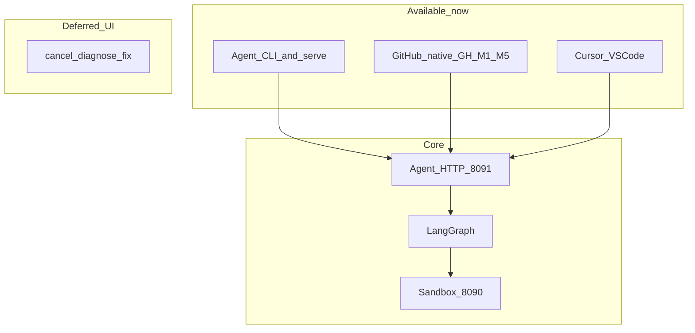

# Raphael Interface Layer

**Status:** Direction accepted · I0 HTTP **served** · **IDE P0 shipped** (VSIX) · **GitHub-native GH-M1–M5** (commands + labels/sticky + opt-in Checks in agent, default off; GH-M5 = pilot docs)  
**Interactive path today:** [CLI → `Usage.md`](Usage.md) · [IDE → `IDE/README.md`](IDE/README.md) · [GitHub-native → `github-native/prd.md`](github-native/prd.md)  
**I0 API lock:** [`prd-i0-api.md`](prd-i0-api.md)  
**Decisions:** [`D-20260810-16`](../decision.md), [`D-20260811-01`](../decision.md), [`D-20260811-02`](../decision.md), [`D-20260811-03`](../decision.md), [`D-20260814-02`](../decision.md) … [`D-20260814-06`](../decision.md)

---

## What this folder is

`interface/` is the **human-facing product layer** for Raphael. It sits *above* the agent and *beside* GitHub/Cursor — never inside the sandbox controller.

| Layer | Path | Job |
|-------|------|-----|
| Sandbox | `sandbox/` | Reproduce & validate failures in isolation |
| Agent | `agent/` | Ingest → diagnose → patch → draft PR / issue snippet (+ future I0 actions / GitHub commands) |
| **Interface** | **`interface/`** | **How humans steer, inspect, apply, and give feedback** |

Until a process split, GitHub-native runtime lives in the **agent**. Operators can also use the CLI and HTTP API in [`Usage.md`](Usage.md) (interface v0). The IDE is a VSIX — [`IDE/README.md`](IDE/README.md).

---

## Documents in this tree

| File | Purpose |
|------|---------|
| [`README.md`](README.md) | This overview — features, architecture, roadmap |
| [`Usage.md`](Usage.md) | **How to use Raphael interactively via CLI (now)** |
| [`prd.md`](prd.md) | Umbrella PRD — shared principles + locked decisions |
| [`prd-i0-api.md`](prd-i0-api.md) | **I0** endpoints, auth, escalate FSM, `delivery_patch`, correlation |
| [`github-native/prd.md`](github-native/prd.md) | GitHub Issues/PRs/Checks slash-command product spec |
| [`github-native/templates/`](github-native/templates/) | Reply copy (`status.md`, `help.md`, terminal + `sticky.md`) |
| [`IDE/prd.md`](IDE/prd.md) | Cursor / VS Code extension product spec |
| [`IDE/README.md`](IDE/README.md) | **Install VSIX + use the P0 extension** |

```text
interface/
├── README.md
├── Usage.md
├── prd.md
├── prd-i0-api.md
├── github-native/
│   ├── prd.md
│   └── templates/
└── IDE/
    └── prd.md
```

Wire schemas (not served yet): `contracts/agent/run_list_response.json`, `run_create_*.json`, `run_action_*.json`.

---

## Product vision

Raphael already delivers remediation as **draft PRs** (Route A) and **issue fix snippets** (Route B). The interface layer makes those outcomes **interactive**:

1. **See** a run’s diagnosis, evidence, sandbox `result_id`, and delivery URL.  
2. **Steer** — retry, escalate, cancel, or start a safe diagnosis — without changing production.  
3. **Act** — apply a Route B snippet in the editor, or jump to the draft PR.  
4. **Learn** — record accepted / rejected / merged / deploy outcomes for offline learning.

Hard product promise (all surfaces, including CLI):

- No auto-merge  
- No production cluster writes  
- No direct calls to the sandbox HTTP API from human UI clients  
- Agent guardrails stay authoritative  

---

## Locked decisions (summary)

| Topic | Lock |
|-------|------|
| Agent listen | `127.0.0.1:8091` |
| Auth | Non-loopback requires `RAPHAEL_INTERFACE_TOKEN` bearer |
| Commands | `/raphael feedback accepted\|rejected\|edited` (no `/raphael accept`) |
| Command host | Agent (`RAPHAEL_GITHUB_COMMANDS=0` default) |
| ACL | write: status/help/feedback; privileged team: retry/diagnose/fix/escalate/cancel |
| Checks | Advisory; conclusion **`neutral`** by default |
| IDE I2 | Local agent only |
| IDE git P0 | Open draft PR URL only; no auto-push |
| GitHub App | Single App for pilot |
| Patch apply | `delivery_patch` resolution in I0 |

---

## Surfaces

### 1. CLI (available now — interface v0)

Full walkthrough: **[`Usage.md`](Usage.md)**.

| Capability | How (today) |
|------------|-------------|
| Safe preflight | `pilot_go_nogo` / `pilot_local_preflight` |
| End-to-end dry-run remediation | `demo_partner` |
| Live or stub sandbox smoke | `smoke` |
| HTTP webhooks + run GET | `raphael-agent-serve` (`:8091`) |
| Human feedback (FR-065) | `record_feedback` |
| Operator metrics | `metrics` |
| Offline learning snapshot | `learn` + `RAPHAEL_LEARNING=1` |

### 2. GitHub-native (GH-M1–M5 — commands in agent, default off)

Runtime lives in the **agent** (`raphael_agent.github_commands`), not a split worker. `interface/github-native/` owns the PRD and reply templates.

Enable with `RAPHAEL_GITHUB_COMMANDS=1`. Parsing does **not** run at default `0`. Bot self-comments are ignored. This path does **not** call the sandbox HTTP API and does **not** widen partner/publish allowlists.

| Knob | Default | Meaning |
|------|---------|---------|
| `RAPHAEL_GITHUB_COMMANDS` | `0` | Master switch for `issue_comment` command parse |
| `RAPHAEL_GITHUB_COMMAND_PREFIX` | `/raphael` | Command prefix |
| `RAPHAEL_GITHUB_COMMAND_TEAM` | unset | Privileged-verb team slug and/or comma-separated logins |
| `RAPHAEL_GITHUB_COMMAND_TEAM_MEMBERS` | unset | Extra privileged logins (no Teams API in GH-M1) |
| `RAPHAEL_GITHUB_COMMAND_RATE_LIMIT` | `10` | Max commands / hour / repo+actor (GH-053) |
| `RAPHAEL_GITHUB_BOT_LOGIN` | `raphael-agent` | Ignore this login (and `login[bot]`) |
| `RAPHAEL_GITHUB_AUTO_COMMENTS` | inherit commands | Unset → same as `COMMANDS`; `0` off; `1` on without parse. Also GH-M3 labels + sticky footer |
| `RAPHAEL_GITHUB_CHECK_RUNS` | `0` | **GH-M4** — `1` enables advisory Check Runs. Does **not** inherit commands/auto-comments |
| `RAPHAEL_GITHUB_CHECK_ADVISORY_SUCCESS` | `0` | `1` may conclude `success` on draft-ready / snippet only; default `neutral`; never `failure` |

| Verb | Status |
|------|--------|
| `status [run_id]` | GH-M1 — explicit arg → thread marker → store lookup |
| `help` | GH-M1 — verbs + partner/publish mode (no secrets) |
| `feedback accepted\|rejected\|edited` | GH-M1 — FR-065 jsonl, never merge |
| `retry [run_id]` | **GH-M2** — admin/team; new run + `parent_run_id`; refuse if parent in-flight |
| `escalate [run_id] [notes]` | **GH-M2** — admin/team; in-flight → `human_requested`; terminal → notes only |
| `cancel` / `diagnose` / `fix` | **Not implemented** (deferred; not part of GH-M5) |
| Check Runs | **GH-M4** — `RAPHAEL_GITHUB_CHECK_RUNS=1`; name `Raphael (advisory)`; conclusion `neutral` (optional advisory `success`) |

ACL: write collaborators (`OWNER` / `MEMBER` / `COLLABORATOR`) → `status` / `help` / `feedback`. `retry` / `escalate` and later privileged verbs require admin (`OWNER`) or team membership.

Terminal auto-comments on `success_draft_pr_ready` / `success_fix_proposed` / `escalated` / `failed_closed` include `run_id`, class, confidence, `result_id`, and are redacted. GH-M3 applies additive labels (`raphael:draft` / `raphael:needs-human` / `raphael:escalated`; never strips `raphael:fix`) and keeps one sticky “Raphael actions” footer (`<!-- raphael:sticky -->`) listing `status` / `feedback` / `help` only — no Merge. Comments, labels, and the footer follow `RAPHAEL_GITHUB_AUTO_COMMENTS` (see `D-20260814-03` and `D-20260814-04`).

GH-M4 Check Runs (`D-20260814-05`) are a **separate** opt-in: `RAPHAEL_GITHUB_CHECK_RUNS=1`. They do not inherit command/auto-comment flags. The Check is named `Raphael (advisory)`, defaults to conclusion `neutral`, never `failure`, and must not be a required merge check. GH-M5 (`D-20260814-06`) is documentation only — permission matrix + pilot install/week/acceptance; `cancel` / `diagnose` / `fix` stay unimplemented.

Local test (no GitHub token; webhook JSON includes the markdown `reply`):

```bash
cd agent
pytest -q tests/test_github_commands.py
# optional live webhook against raphael-agent-serve:
#   RAPHAEL_GITHUB_COMMANDS=1
#   POST /v1/webhooks/github  X-GitHub-Event: issue_comment
```

Correlation: `/raphael status run-abc123`, then `<!-- raphael:run_id=… -->` or `raphael:run_id=…` on the Issue/PR body, then latest run for that number. Duplicate GitHub deliveries are idempotent (`comment_id` / `X-GitHub-Delivery`).

### 3. IDE / Cursor plugin (P0 shipped)

See [`IDE/README.md`](IDE/README.md). Install via VSIX; Runs panel, Apply Fix, Open Draft PR, Feedback.

ChatOps (Slack/Teams) is **not** in this folder — root [`prd.md`](../prd.md) §25.

---

## Architecture



**Rule:** Interfaces never talk to `RAPHAEL_SANDBOX_URL`. Only the agent does.

---

## Delivery phases

| Phase | Focus | Exit |
|-------|--------|------|
| **I0** | Contracts (docs+schemas done; HTTP next) | [`prd-i0-api.md`](prd-i0-api.md) |
| **I1** | GitHub-native P0 commands in agent | **Done GH-M1–M5** (`status`/`help`/`feedback`/`retry`/`escalate` + labels/sticky + opt-in Checks + pilot docs); `cancel`/`diagnose`/`fix` still later |
| **I2** | IDE P0 vs local agent | Apply fix + feedback |
| **I3** | Advisory Checks | **Done (GH-M4)** — `RAPHAEL_GITHUB_CHECK_RUNS=1`, conclusion `neutral` |
| **I4** | IDE decorations / branch opt-in | |
| **I5** | Non-loopback auth, harden | Permission-matrix |

---

## Related docs

| Doc | Why |
|-----|-----|
| [`Usage.md`](Usage.md) | CLI operator manual |
| [`prd-i0-api.md`](prd-i0-api.md) | Action API lock |
| [`../agent/README.md`](../agent/README.md) | Agent setup |
| [`../docs/permission-matrix.md`](../docs/permission-matrix.md) | May / may not |
| [`../handoff.md`](../handoff.md) | Team context |

**Use Raphael today:** open [`Usage.md`](Usage.md).
