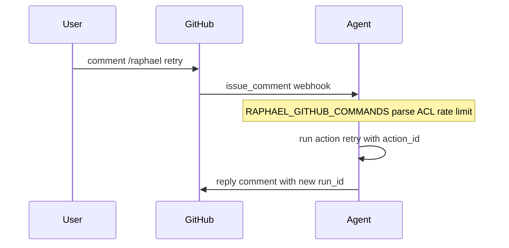

# GitHub-native interface — Product Requirements

**Document status:** GH-M1–M5 complete (commands/auto-comments/Checks default off in the agent; GH-M5 is documentation). `cancel` / `diagnose` / `fix` remain unimplemented.  
**Parent:** [`../prd.md`](../prd.md)  
**Folder:** `interface/github-native/`  
**Product stage:** Post-MVP (I1 / I3 in parent plan)  
**Primary users:** Platform/SRE on-call, application engineers reviewing Raphael PRs  
**Depends on:** Agent webhooks + run store; single GitHub App for pilot; I0 action APIs in [`../prd-i0-api.md`](../prd-i0-api.md)  
**Command host (pilot):** Agent HTTP (`RAPHAEL_GITHUB_COMMANDS=1`); this folder owns PRD + reply templates until a process split is justified

---

## 1. Vision

Make **GitHub itself** the interactive console for Raphael: trigger, inspect, steer, and give feedback on remediation runs without a separate web app and without leaving the PR/Issue that already carries the audit story.

Root PRD §13 already requires PRs to be understandable without an agent console. This surface goes further: **actions** (retry, escalate, reject class, re-run validation) become first-class GitHub interactions.

---

## 2. Personas and jobs-to-be-done

| Persona | Job | Success look |
|---------|-----|--------------|
| On-call SRE | Understand why Raphael opened a draft / escalated | Comment or Check shows diagnosis + evidence links in &lt;30s |
| On-call SRE | Retry after flaky CI or missing workspace config | `/raphael retry` creates a new run, linked to prior `run_id` |
| App engineer | Reject a bad proposed fix without hunting CLI | PR comment or review → feedback `rejected` recorded |
| App engineer | Accept Route B snippet path | Issue command → “open PR from snippet” guidance or draft if allowlisted |
| Security admin | Constrain who can force live publish | Commands respect partner mode; no command widens allowlists |
| FDE / pilot | Demo on partner repo | Label + comment flow works in dry-run |

---

## 3. Relationship to existing agent behavior

| Existing today | GitHub-native adds |
|----------------|-------------------|
| `workflow_run` / `check_run` / deployment-status → ingest | Same; plus **interactive** issue/PR comment commands |
| Label `raphael:fix` → Route B | Keep; add command verbs and status replies |
| Draft PR body (FR-060–064) | Structured follow-up comments + Check annotations |
| `pull_request` webhook → feedback jsonl | Explicit `/raphael feedback accepted\|rejected\|edited` and mapped review events |
| Partner dry-run placeholder PR URLs | Commands must not imply live publish when dry-run |

**Boundary:** Detection/normalization stays in `agent/raphael_agent/ingest`. Pilot **command parsing** also runs in the agent when `RAPHAEL_GITHUB_COMMANDS=1`, calling I0 action handlers. This package owns **reply templates, Check Run presentation copy, and (later) a thin client** — not a second diagnosis engine.

### 3.1 Run correlation

Resolve `run_id` for `/raphael status` and related verbs:

1. Explicit arg: `/raphael status run-abc123`  
2. Thread marker: `<!-- raphael:run_id=… -->` or footer `raphael:run_id=…`  
3. Store lookup: latest run for `issue_number` / `pull_request_number` via I0 `GET /v1/runs`

Retries set `parent_run_id` and copy correlation unless overridden.

### 3.2 Escalate semantics

See I0 state machine. Summary:

- **In-flight** (`pending`/`running`): stop patch/publish → `escalated`, `terminal_reason=human_requested`; never invent a patch.  
- **Already terminal:** audit + optional notes/feedback only; do not rewrite a success terminal to escalated.

---

## 4. Functional requirements

### 4.1 Command surface (P0)

Commands appear as Issue or PR comments (bot ignores its own comments). Prefix configurable; default:

```text
/raphael <verb> [args]
```

| ID | Verb | Behavior | Priority |
|----|------|----------|----------|
| GH-001 | `status` | Reply with run summary for linked `run_id` or latest run for Issue/PR | P0 |
| GH-002 | `retry` | Enqueue new run from same fingerprint/seed; link `parent_run_id` | P0 |
| GH-003 | `escalate` | Mark human-requested escalate; persist feedback/notes; do not invent a patch | P0 |
| GH-004 | `cancel` | Cancel in-flight run if agent supports cancel; else reply with kill-switch guidance | P1 |
| GH-005 | `feedback accepted\|rejected\|edited` | Write FR-065 feedback tied to PR/Issue | P0 |
| GH-006 | `diagnose` | Manual trigger: create run in `diagnosis_only` or partner-safe mode | P1 |
| GH-007 | `fix` | Route B-style: only if label/policy allows; never widens allowlist | P1 |
| GH-008 | `help` | List verbs + current partner/publish mode (no secrets) | P0 |

**ACL (locked):** collaborators with `write` may run `status`, `help`, `feedback`; `retry` / `diagnose` / `fix` / `escalate` / `cancel` require repo `admin` **or** membership in `RAPHAEL_GITHUB_COMMAND_TEAM`.

### 4.2 Automatic comments (P0)

| ID | Requirement | Priority |
|----|-------------|----------|
| GH-010 | On run terminal `success_draft_pr_ready`, ensure PR exists (agent publish) and post a short “how to review” comment if missing | P0 |
| GH-011 | On `success_fix_proposed`, post/refresh Issue comment with snippet fence + IDE deep link (see IDE PRD) | P0 |
| GH-012 | On `escalated` / `failed_closed`, post terminal reason + evidence pointers + suggested next human step | P0 |
| GH-013 | All bot comments include `run_id`, failure class, confidence, sandbox `result_id` when present | P0 |
| GH-014 | Comments never include secret-like values; reuse agent redaction | P0 |

### 4.3 Labels (P0/P1)

| ID | Requirement | Priority |
|----|-------------|----------|
| GH-020 | Keep `RAPHAEL_ISSUE_TRIGGER_LABEL` (default `raphael:fix`) as Route B trigger | P0 (exists) |
| GH-021 | Apply `raphael:draft`, `raphael:escalated`, `raphael:needs-human` on PRs/Issues from terminal state | P1 |
| GH-022 | `raphael:learning-demoted` optional label when diagnosis.learning.prefer_escalate | P2 |
| GH-023 | Removing `raphael:fix` does not delete history; only stops new Route B triggers | P0 |

### 4.4 Checks and commit status (P1 → I3)

| ID | Requirement | Priority |
|----|-------------|----------|
| GH-030 | Create/update a Check Run `Raphael` on the failing SHA when a run starts | P1 |
| GH-031 | Check output summarizes diagnosis, validation matrix, link to draft PR or escalation | P1 |
| GH-032 | Annotations point at allowlisted file paths when patch touches them | P1 |
| GH-033 | Check conclusion: default **`neutral`** (advisory). Optional opt-in non-required `success` only when partner explicitly configures advisory-success; never a required check for merge | P1 |
| GH-034 | Never mark GitHub in a way that bypasses required human review for merge; Check name should read as advisory (e.g. `Raphael (advisory)`) | P0 |

### 4.5 Pull request experience extensions (P0/P1)

| ID | Requirement | Priority |
|----|-------------|----------|
| GH-040 | Preserve root PRD §13 body sections (agent publish remains authoritative) | P0 |
| GH-041 | Add a sticky “Raphael actions” footer comment: status / feedback commands | P1 |
| GH-042 | Map `pull_request` closed/merged/edited to feedback (exists); surface ack comment optional | P1 |
| GH-043 | Request reviewers from `RAPHAEL_GITHUB_REVIEWERS` + optional CODEOWNERS (exists) | P0 |
| GH-044 | Draft-only: interface must not offer a “Merge” action | P0 |

### 4.6 Safety and policy (P0)

| ID | Requirement | Priority |
|----|-------------|----------|
| GH-050 | Commands respect `RAPHAEL_PARTNER_MODE` / `RAPHAEL_PUBLISH_MODE` / live class allowlist | P0 |
| GH-051 | No command may widen path allowlists or unblock blocked failure classes | P0 |
| GH-052 | Global kill switch / per-repo disable honored; reply explains disabled state | P0 |
| GH-053 | Rate-limit commands per repo and per actor (default: 10/hour) | P0 |
| GH-054 | Idempotent command handling via GitHub `comment_id` / delivery id | P0 |
| GH-055 | All command invocations append audit events on the run record | P0 |

---

## 5. Non-goals

- ChatOps outside GitHub (Slack/Teams).
- Editing production Kubernetes from a comment.
- Auto-merge on `/raphael feedback accepted` (feedback only; never merge).  
- Slash alias `/raphael accept` (rejected grammar — use `feedback accepted`).
- Replacing branch protection or required checks with Raphael Checks alone.
- Hosting a separate comment parser inside the sandbox controller.
- Scraping arbitrary Issue HTML; only GitHub API + webhook payloads.

---

## 6. UX copy guidelines

- Voice: concise, evidence-first, same as PR body tone.
- Always state **mode**: `dry_run` | `allowlist` | `diagnosis_only`.
- On uncertainty: prefer escalate copy over fake confidence.
- Deep links: prefer GitHub URLs; optional `cursor://` / IDE URI for snippets (coordinate with IDE PRD).

Example `status` reply:

```markdown
### Raphael run `run-abc123`
- **Status:** success_draft_pr_ready
- **Class:** probe_misconfiguration (confidence 0.81)
- **Sandbox result:** `res-…`
- **Delivery:** draft PR → https://github.com/org/repo/pull/42
- **Mode:** partner=dry_run publish=dry_run

Commands: `/raphael feedback accepted` · `/raphael feedback rejected` · `/raphael retry` · `/raphael help`
```

---

## 7. Technical design (pilot runtime is in the agent)

### 7.1 Suggested package layout

```text
interface/github-native/
  prd.md                 ← this file
  README.md              ← setup (when implemented)
  src/                   ← TypeScript or Python client/handlers (TBD at I0)
  templates/             ← markdown reply templates
  tests/
```

Language: reply templates may be Markdown files here; **runtime command parse for pilot is in `agent/`**. A future Node/Python worker under this folder is optional and must not fork diagnosis.

### 7.2 Event flow



### 7.3 GitHub App permissions (pilot)

| Permission | Access | Why |
|------------|--------|-----|
| Checks | Read & write | Opt-in Check Runs (`RAPHAEL_GITHUB_CHECK_RUNS=1`); never required for merge |
| Contents | Read | Optional; agent publish may already use PAT/App |
| Issues | Read & write | Commands + Route B comments |
| Pull requests | Read & write | Draft PR comments / labels |
| Metadata | Read | Required |
| Actions | Read | Correlate workflow_run (if not solely via webhook payload) |

**Must not request:** Administration, Secrets, Environments (write), Workflows (write).

### 7.4 Config knobs (proposed)

| Variable | Default | Meaning |
|----------|---------|---------|
| `RAPHAEL_GITHUB_COMMAND_PREFIX` | `/raphael` | Command prefix |
| `RAPHAEL_GITHUB_COMMANDS` | `0` | Master switch (agent-side command parse) |
| `RAPHAEL_GITHUB_AUTO_COMMENTS` | inherit `COMMANDS` | Terminal comments + GH-M3 labels/sticky; unset inherits commands; `0`/`1` override |
| `RAPHAEL_GITHUB_COMMAND_TEAM` | unset | Team slug for privileged verbs |
| `RAPHAEL_GITHUB_CHECK_RUNS` | `0` | Enable advisory Checks; does **not** inherit commands/auto-comments |
| `RAPHAEL_GITHUB_CHECK_ADVISORY_SUCCESS` | `0` | Opt-in `success` conclusion on draft-ready / snippet only; never `failure` |
| `RAPHAEL_INTERFACE_AGENT_URL` | `http://127.0.0.1:8091` | Agent base when a split worker exists |
| `RAPHAEL_INTERFACE_TOKEN` | unset | Bearer for non-loopback agent API |

---

## 8. Acceptance criteria

1. On a fixture repo, posting `/raphael status` on an Issue linked to a finished dry-run returns a bot comment with correct `run_id` and mode.
2. `/raphael feedback rejected` appends a schema-valid feedback event and is visible to `raphael-agent-learn`.
3. `/raphael retry` under `PARTNER_MODE=dry_run` never opens a live PR even if `PUBLISH_MODE=live` is mis-set (partner gate wins — same as agent).
4. Check Run (when enabled) never alone satisfies “merge without human.”
5. Unit tests cover command parse, ACL deny, rate limit, and idempotent duplicate delivery.
6. No new code path calls the sandbox HTTP API from this package.

---

## 9. Test plan

| Layer | What |
|-------|------|
| Unit | Verb parser, ACL, template rendering |
| Contract | Action API request/response schemas |
| Integration | Webhook fixture → agent TestClient → comment payload asserted |
| Partner | Dry-run week: ≥5 command interactions recorded |

---

## 10. Milestones

| Milestone | Deliverable | Status |
|-----------|-------------|--------|
| GH-M1 | Parser + `status` / `help` / `feedback` against agent API | **Done** (agent, `RAPHAEL_GITHUB_COMMANDS=1`) |
| GH-M2 | `retry` / `escalate` + terminal auto-comments | **Done** (agent; auto-comments via `RAPHAEL_GITHUB_AUTO_COMMENTS`) |
| GH-M3 | Labels + sticky PR footer | **Done** (agent; same `RAPHAEL_GITHUB_AUTO_COMMENTS` gate as GH-M2) |
| GH-M4 | Check Runs + annotations | **Done** (agent; `RAPHAEL_GITHUB_CHECK_RUNS=1`, conclusion `neutral`) |
| GH-M5 | Permission-matrix + pilot doc updates | **Done** ([`docs/permission-matrix.md`](../../docs/permission-matrix.md), install/week/acceptance; `D-20260814-06`) |

---

## 11. Resolved questions

1. **Single App** for pilot (ingest + interactive commands).  
2. `/raphael feedback accepted` is **feedback-only** (never GitHub PR “approve” unless a future opt-in is added; never merge).  
3. IDE deep link: `vscode://raphael.raphael-ide/run/{run_id}` with copy-`run_id` fallback (see IDE PRD).  
4. Command transcripts on run `audit_events`; optional `interface_events.jsonl` later — not required for I1.

---

## 12. Document control

| Version | Date | Notes |
|---------|------|-------|
| 0.1.0 | 2026-08-10 | Initial github-native PRD; implementation deferred |
| 0.2.0 | 2026-08-11 | Feedback grammar, escalate/correlation, Checks neutral, agent-hosted commands |
| 0.3.0 | 2026-08-14 | GH-M1 implemented in agent (`status`/`help`/`feedback`); later milestones still deferred |
| 0.4.0 | 2026-08-14 | GH-M2 `retry`/`escalate` + terminal auto-comments |
| 0.5.0 | 2026-08-14 | GH-M3 labels + sticky footer |
| 0.6.0 | 2026-08-14 | GH-M4 advisory Check Runs; cancel/diagnose/fix and GH-M5 still deferred |
| 0.7.0 | 2026-08-14 | GH-M5 permission matrix + pilot docs; `cancel`/`diagnose`/`fix` still unimplemented |
