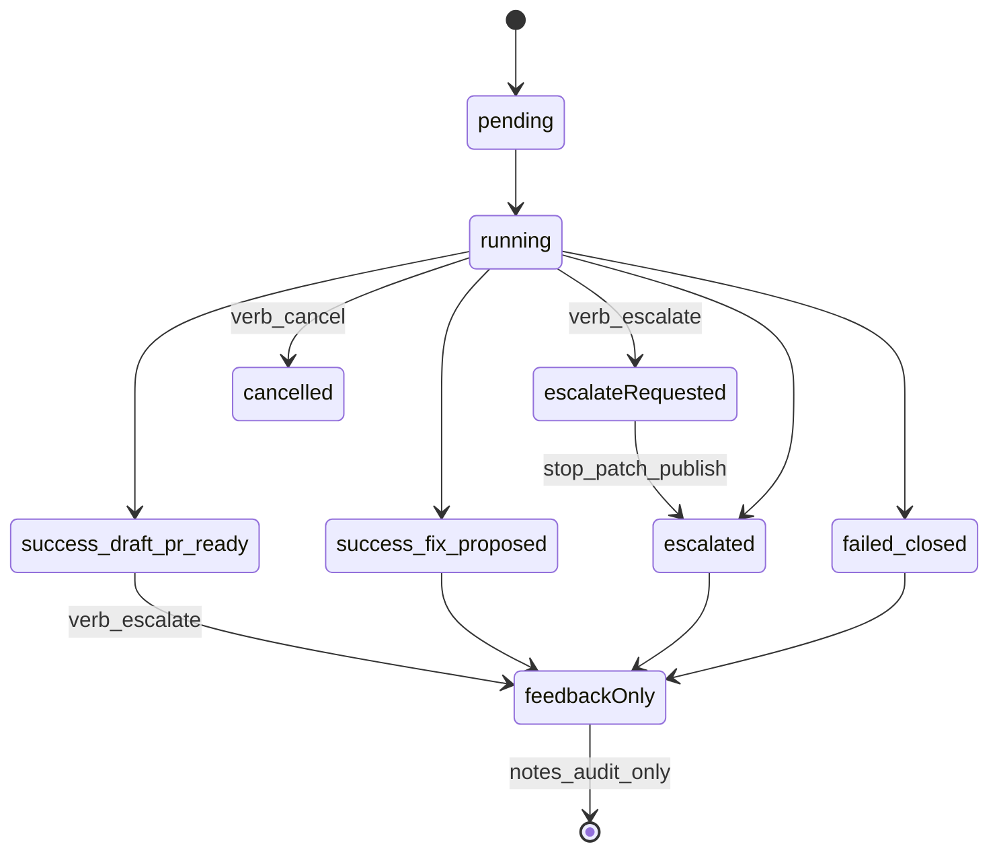

# Interface I0 — Agent action API contracts

**Document status:** Accepted · **HTTP served** on agent (`raphael-agent-serve`)  
**Parent:** [`prd.md`](prd.md)  
**Decisions:** [`D-20260811-01`](../decision.md) (locks), [`D-20260811-02`](../decision.md) (implementation)  
**Wire schemas:** [`../contracts/agent/`](../contracts/agent/) (`run_list_response.json`, `run_create_*.json`, `run_action_*.json`)  
**Listen address:** `RAPHAEL_AGENT_LISTEN` default **`127.0.0.1:8091`**

This addendum locks the **I0** surface that GitHub-native commands and the IDE plugin require. Routes are implemented in `agent/raphael_agent/http_api/app.py` + `agent/raphael_agent/runs/`.

---

## 1. Goals

1. One agent HTTP API for CLI, GitHub command handlers (in-agent), and IDE.  
2. Idempotent human actions (`action_id`) so webhook retries do not double-run.  
3. Same partner/publish gates as today’s graph — UI cannot bypass allowlists.  
4. Stable **delivery_patch** read model for IDE “Apply Fix.”  
5. Durable **run correlation** to Issues/PRs.

---

## 2. Authentication

| Client bind | `RAPHAEL_INTERFACE_TOKEN` set | Required header |
|-------------|-------------------------------|-----------------|
| Loopback (`127.0.0.1` / `::1`) | unset | None (pilot only) |
| Loopback | set | `Authorization: Bearer <token>` |
| Non-loopback | **must be set** | `Authorization: Bearer <token>` |

- Missing/invalid bearer on a requiring bind → **401** `unauthorized`.  
- Token present but actor lacks ACL for privileged action → **403** `forbidden`.  
- GitHub App → agent calls use the interface token (or mTLS later); never embed sandbox admin credentials.  
- Webhook HMAC (`RAPHAEL_GITHUB_WEBHOOK_SECRET`) remains separate from interface bearer auth.

---

## 3. Endpoints

### 3.1 `GET /v1/runs` (list) — **served**

Query parameters:

| Param | Type | Meaning |
|-------|------|---------|
| `owner` | string | Filter `repository.owner` |
| `repo` | string | Filter `repository.name` |
| `status` | string | Terminal/in-progress status |
| `issue_number` | int | Correlation filter |
| `pull_request_number` | int | Correlation filter |
| `limit` | int | Default 20, max 100 |
| `cursor` | string | Opaque pagination cursor |

Response: `run_list_response.json` (summary rows + `next_cursor`).

### 3.2 `GET /v1/runs/{run_id}` — **exists**

Full `run_record.json`. Implementations MUST expose correlation fields when known:

- `issue_number`, `issue_comment_url`  
- `pull_request_url`, `pull_request_number` (optional field), `pull_request_branch`  
- `parent_run_id` (optional; set on retries)  
- `trigger.kind` including manual variants  

Derived read-only helper for clients (may be computed, not stored):

**`delivery_patch`** — see §5.

### 3.3 `POST /v1/runs` (manual create) — **served**

Body: `run_create_request.json`.

| Field | Required | Notes |
|-------|----------|-------|
| `trigger_kind` | yes | `manual_ui` \| `manual_ide` \| `manual_github` |
| `action_id` | yes | Client idempotency key (unique per tenant+actor+verb family) |
| `repository` | yes | `{owner,name}` |
| `commit_sha` | yes | |
| `workspace_path` / `manifests` | optional | Same as fixture/smoke |
| `sandbox_mode` | optional | `live` \| `recorded_stub` \| `skipped`; default from env |
| `issue_number` / `pull_request_number` | optional | Correlation |
| `notes` | optional | Bounded |

Behavior:

1. If `action_id` already created a run → **200** same run (`idempotent_replay: true`).  
2. Else create pending/running seed → optionally run graph (server policy / `RAPHAEL_INGEST_RUN_GRAPH` analogue for manual).  
3. Partner gates apply; live publish still requires allowlist.

Response: `run_create_response.json`.

### 3.4 `POST /v1/runs/{run_id}/actions` — **served**

Body: `run_action_request.json`.

| `verb` | ACL | Behavior |
|--------|-----|----------|
| `retry` | privileged | New run from prior seed/fingerprint; `parent_run_id` = source; new `run_id` |
| `escalate` | privileged | See §4 state machine |
| `cancel` | privileged | In-flight → `cancelled` + `terminal_reason=cancelled` when supported; else guidance |
| `feedback` | write | Append FR-065 event (`outcome` required) |

All verbs require `action_id`. Duplicate `action_id` → **200** prior result (`idempotent_replay: true`) or **409** `conflict_idempotency` if payload differs.

Response: `run_action_response.json`.

### 3.5 Existing (unchanged)

- `POST /v1/feedback`  
- `GET /v1/metrics`, `GET /v1/pilot/go-nogo`  
- `POST /v1/webhooks/github`, `POST /v1/webhooks/k8s`  

GitHub slash commands are parsed **inside the agent** when `RAPHAEL_GITHUB_COMMANDS=1` (default **off**), then call the same action handlers as §3.4.

---

## 4. Escalate state machine



| Run state when `escalate` received | Effect |
|------------------------------------|--------|
| `pending` / `running` | Stop further patch/publish; terminal `escalated`, `terminal_reason=human_requested`; audit + optional feedback notes; **never invent a patch** |
| Already terminal | Append audit + optional feedback/notes only; do **not** rewrite success → escalated |

`retry` always creates a **new** `run_id` (never mutates the parent terminal in place).

---

## 5. `delivery_patch` resolution (IDE Apply Fix)

Clients resolve a unified diff in this order (first non-empty wins):

1. Selected candidate: `candidate_patches[]` entry matching diagnosis selection / latest allowed patch with non-null `unified_diff`.  
2. Else concatenate non-null `files[].unified_diff_hunk` for that patch.  
3. Else `publish.fix_snippet` (Route B).  
4. Else empty → IDE must refuse Apply with a clear error.

Allowlist metadata comes from the same patch’s paths + repo `.raphael` / agent policy already enforced at patch time; IDE re-checks workspace escape.

---

## 6. Run correlation (Issue / PR ↔ `run_id`)

1. **Store fields:** `issue_number`, `pull_request_number`, `pull_request_url`, `parent_run_id`.  
2. **GitHub markers** (bot comments / PR body footer):

```text
<!-- raphael:run_id=run-abc123 -->
raphael:run_id=run-abc123
```

3. **`/raphael status`** resolves: explicit `run_id` arg → marker on thread → latest run for `issue_number` / PR number via list filter.  
4. Retries copy correlation from parent unless the action overrides.

---

## 7. Error envelope

HTTP JSON errors SHOULD use:

```json
{
  "error": {
    "code": "unauthorized",
    "message": "human readable",
    "retryable": false
  }
}
```

| `code` | When |
|--------|------|
| `unauthorized` | Missing/invalid bearer |
| `forbidden` | ACL / kill switch / repo disabled |
| `not_found` | Unknown `run_id` |
| `conflict_idempotency` | Same `action_id`, different body |
| `partner_gate` | Partner/publish/allowlist blocked the effect |
| `invalid_request` | Schema/validation failure |
| `conflict_state` | Verb illegal for current status (e.g. cancel on terminal) |

---

## 8. Locked product defaults (I0)

| Topic | Lock |
|-------|------|
| Trigger kinds (manual) | `manual_ui` \| `manual_ide` \| `manual_github` |
| GitHub App | Single App for pilot (ingest + commands) |
| Command grammar | `/raphael feedback accepted\|rejected\|edited` only (no `/raphael accept`) |
| Command host | Agent (`RAPHAEL_GITHUB_COMMANDS`); `interface/github-native/` = docs/templates until split |
| ACL write | `status`, `help`, `feedback` |
| ACL privileged | `retry`, `diagnose`, `fix`, `escalate`, `cancel` via `RAPHAEL_GITHUB_COMMAND_TEAM` or admin |
| Checks | Advisory; conclusion **`neutral`** by default |
| IDE I2 network | Local agent only |
| IDE git P0 | Open draft PR URL only; no push |

---

## 9. Implementation exit

- [x] Schemas validated in agent tests  
- [x] Routes registered in `http_api`  
- [x] Bearer middleware matches §2  
- [x] Idempotency store for `action_id`  
- [x] `cancelled` + `human_requested` honored  
- [ ] Permission-matrix + slash-command ACL wiring (I1)  
- [x] `interface/Usage.md` curl examples for I0  

Operators may use CLI **or** these HTTP APIs per [`Usage.md`](Usage.md).
