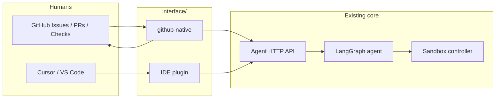

# Raphael Interface Layer — Product Requirements

**Document status:** Draft for later implementation (not in current engineering critical path)  
**Product stage:** Post-MVP interactive surfaces  
**Depends on:** Agent Phases 0–6 + Option B (`agent/`), contracts under `contracts/agent/`  
**Does not own:** Sandbox controller (`sandbox/`), core LangGraph workflow, allowlist policy  
**Related:** Root [`prd.md`](../prd.md) §13 (PR experience), §25 (ChatOps / future), [`docs/permission-matrix.md`](../docs/permission-matrix.md)

---

## 1. Executive summary

Raphael’s MVP delivers remediation through **draft PRs** and **issue fix snippets**. The interface layer makes those outcomes **interactive** without inventing a separate ops console first.

Two surfaces are in scope for this PRD set:

1. **GitHub-native** — treat GitHub Issues, PRs, Checks, and slash-style comments as the primary operator UI.
2. **IDE / Cursor plugin** — bring run context, proposed diffs, and “open PR / apply snippet” into the editor.

Both live under `interface/` and talk to the agent over its existing HTTP API (plus GitHub APIs where the surface is GitHub itself). Implementation is **deferred**; this document freezes product intent so later work does not weaken MVP guardrails.

---

## 2. Problem

| Pain | Today | Gap |
|------|--------|-----|
| Operator wants to steer a run | Webhooks + CLI + env knobs | No in-GitHub “retry / escalate / reject class” verbs |
| App engineer reviews a draft PR | Rich PR body (good) | Limited structured actions beyond GitHub’s native review |
| Route B posts a fix snippet on an Issue | Comment only | Applying the snippet locally is copy-paste |
| Partner demo / FDE debug | `demo_partner` CLI | No in-IDE run browser tied to the failing commit |

ChatOps (Slack/Teams) remains a separate Post-MVP item in root `prd.md` §25 and is **out of scope** for this folder.

---

## 3. Product principles (interface-specific)

1. **Git / editor first:** Prefer surfaces engineers already use over a new SaaS console.
2. **Thin client:** Interfaces orchestrate and display; the agent decides.
3. **Same permission envelope:** Partner mode, publish mode, path allowlists, and kill switches apply unchanged.
4. **Audit everything:** Every human action from an interface becomes a feedback or run audit event (FR-065 family).
5. **Dry-run safe by default:** Interactive triggers default to diagnosis / dry-run publish unless partner allowlist gates pass.
6. **No secret amplification:** UIs never display redacted secret material; never request Secret payloads.

---

## 4. Architecture

### 4.1 Folder ownership

| Path | Owns | Must not own |
|------|------|--------------|
| `interface/github-native/` | GitHub App command handlers, comment/check UX, label bots that are *interactive* (beyond today’s ingest webhooks) | Diagnosis templates, sandbox verbs |
| `interface/IDE/` | Extension UI, local workspace actions, Cursor-specific commands | Production kube credentials, bypassing publish gates |
| `agent/` | Runs, policy, publish, learning priors | Presentation chrome |
| `sandbox/` | Reproduce / validate | Any human UI |

Today’s ingest webhooks in `agent/raphael_agent/http_api` remain the **detection** path. GitHub-native interface work **extends** interaction after a run exists (and may add command comments). It should not fork a second diagnosis engine.

### 4.2 Shared agent API contract (minimum)

Interfaces rely on these existing or soon-to-be-extended endpoints:

| Capability | Current | Interface need |
|------------|---------|----------------|
| Ingest GitHub webhook | `POST /v1/webhooks/github` | Keep; github-native may add command events |
| Ingest K8s watcher | `POST /v1/webhooks/k8s` | Read-only status in IDE; no direct create |
| Get run | `GET /v1/runs/{run_id}` | Primary read model for both UIs |
| Feedback | `POST /v1/feedback` | Approve / reject / edit signals |
| Metrics / go-nogo | `GET /v1/metrics`, `GET /v1/pilot/go-nogo` | IDE status panel / partner preflight |
| Trigger run (manual) | CLI / fixtures today | **New (P0 for interfaces):** `POST /v1/runs` or `POST /v1/runs/{id}/actions` |
| Cancel run | kill switch env today | **New (P1):** `POST /v1/runs/{id}/cancel` |

New endpoints, when added, live in `agent/` with contracts under `contracts/agent/`; interface packages are clients only.

### 4.3 Auth model

| Surface | Auth |
|---------|------|
| GitHub-native | GitHub App installation + webhook secret; commands only in installed repos |
| IDE | User PAT or GitHub App device/user token **plus** agent API token / mTLS later; never embed sandbox admin credentials |
| Agent API | Shared secret or signed JWT (`RAPHAEL_INTERFACE_TOKEN` — to be defined at implement time) |

---

## 5. Non-goals (entire interface layer)

- Auto-merge or “Approve and deploy to prod” buttons.
- Direct `kubectl` apply / restart / rollback from UI.
- Replacing GitHub CODEOWNERS or branch protection.
- Multi-tenant SaaS console (may come later; not this PRD).
- Slack/Teams ChatOps (tracked separately).
- Training models from UI clicks mid-incident.
- Calling `RAPHAEL_SANDBOX_URL` from browser/extension code.

---

## 6. Success metrics

| Metric | Target (first pilot of interfaces) |
|--------|-------------------------------------|
| Time from draft PR → first human reaction recorded as feedback | ↓ vs CLI-only feedback |
| % of Route B snippets applied via IDE “Apply fix” vs manual paste | Track; goal ≥ 50% of snippet runs in IDE-using partners |
| Accidental live publish from UI | **0** |
| Interface-triggered runs that bypass partner allowlist | **0** |
| Operator can complete retry / escalate / reject without leaving GitHub | Yes for github-native P0 verbs |

---

## 7. Phased delivery (when we build)

| Phase | Focus | Exit |
|-------|--------|------|
| **I0 — Contracts** | Action API + schemas; no UX | OpenAPI/contracts + agent tests |
| **I1 — GitHub-native P0** | Comment commands + richer run comments | Partner can `/raphael status\|retry\|escalate` on Issue/PR |
| **I2 — IDE P0** | Run browser + apply snippet + open draft PR link | Cursor extension installs; works against local agent |
| **I3 — GitHub Checks** | Check Run annotations for diagnosis/validation | Annotations on failing SHA |
| **I4 — IDE deepen** | Diff preview, local branch create (opt-in), learning feedback buttons | Feature-complete vs IDE PRD P1 |
| **I5 — Harden** | App permissions review, rate limits, audit export | Permission-matrix update signed off |

GitHub-native and IDE may proceed in parallel after I0; **I0 is a hard dependency**.

---

## 8. Cross-surface UX consistency

Both surfaces must show the same mental model:

1. **Run** — `run_id`, status, terminal reason  
2. **Diagnosis** — failure class, confidence, selected hypothesis  
3. **Evidence** — redacted excerpts + provenance links  
4. **Patch** — unified diff or “no patch / escalated”  
5. **Validation** — sandbox result_id, before/after signature  
6. **Delivery** — draft PR URL **or** issue snippet  
7. **Feedback** — accepted / edited / rejected / merged / deploy_*  

Status vocabulary matches agent terminals:

`pending` · `running` · `success_draft_pr_ready` · `success_fix_proposed` · `escalated` · `failed_closed` · `cancelled`

---

## 9. Sub-PRDs

| Document | Scope |
|----------|--------|
| [`github-native/prd.md`](github-native/prd.md) | Commands, comments, labels, Checks, App permissions |
| [`IDE/prd.md`](IDE/prd.md) | Cursor/VS Code extension, apply snippet, local workflow |

---

## 10. Open questions (resolve at I0)

1. Should manual `POST /v1/runs` require a GitHub delivery idempotency key or a new `trigger_kind=manual_ui`?
2. Single GitHub App for ingest + interactive commands, or separate App for least privilege?
3. IDE: talk to local agent only for pilot, or cloud-hosted agent URL with SSO?
4. May the IDE create a local git branch and push, or only open the agent’s draft PR URL?
5. Command ACL: repo admins only, or any write collaborator?

---

## 11. Document control

| Version | Date | Notes |
|---------|------|-------|
| 0.1.0 | 2026-08-10 | Initial interface-layer PRD; implementation deferred |
