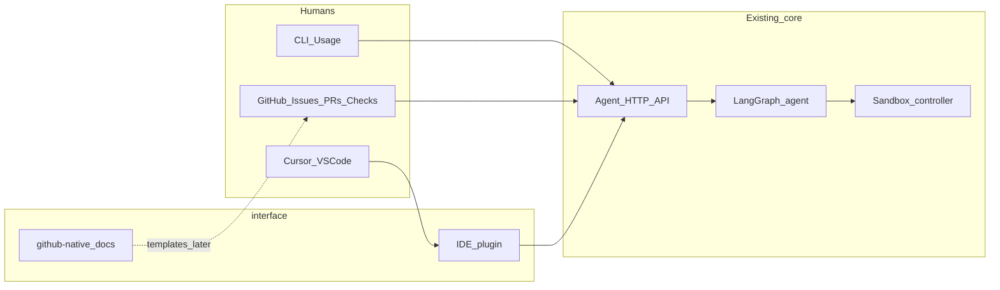

# Raphael Interface Layer — Product Requirements

**Document status:** Direction accepted · I0 contracts drafted · UI implementation deferred  
**Product stage:** Post-MVP interactive surfaces  
**Depends on:** Agent Phases 0–6 + Option B (`agent/`), contracts under `contracts/agent/`  
**I0 API lock:** [`prd-i0-api.md`](prd-i0-api.md) + `contracts/agent/run_*_{list,create,action}_*.json`  
**Does not own:** Sandbox controller (`sandbox/`), core LangGraph workflow, allowlist policy  
**Related:** Root [`prd.md`](../prd.md) §13 (PR experience), §25 (ChatOps / future), [`docs/permission-matrix.md`](../docs/permission-matrix.md), [`Usage.md`](Usage.md)

---

## 1. Executive summary

Raphael’s MVP delivers remediation through **draft PRs** and **issue fix snippets**. The interface layer makes those outcomes **interactive** without inventing a separate ops console first.

Surfaces:

0. **CLI (interface v0 — available now)** — agent scripts + `raphael-agent-serve`; see [`Usage.md`](Usage.md).  
1. **GitHub-native** — Issues, PRs, Checks, and `/raphael …` comments as the primary operator UI.  
2. **IDE / Cursor plugin** — run context, proposed diffs, and apply-snippet / open-PR in the editor.

Both GitHub-native and IDE talk to the agent over HTTP (plus GitHub APIs where the surface is GitHub). Slash-command handling for pilot lives **inside the agent** (`RAPHAEL_GITHUB_COMMANDS`, default off) so one webhook URL remains; `interface/github-native/` holds PRDs/templates until a process split is justified.

---

## 2. Problem

| Pain | Today | Gap |
|------|--------|-----|
| Operator wants to steer a run | Webhooks + CLI + env knobs | No in-GitHub “retry / escalate / reject” verbs (CLI covers feedback today) |
| App engineer reviews a draft PR | Rich PR body (good) | Limited structured actions beyond GitHub’s native review |
| Route B posts a fix snippet on an Issue | Comment only | Applying the snippet locally is copy-paste |
| Partner demo / FDE debug | `demo_partner` CLI | No in-IDE run browser tied to the failing commit |

ChatOps (Slack/Teams) remains a separate Post-MVP item in root `prd.md` §25 and is **out of scope** for this folder.

---

## 3. Product principles (interface-specific)

1. **Git / editor first:** Prefer surfaces engineers already use over a new SaaS console.  
2. **Thin client:** Interfaces orchestrate and display; the agent decides.  
3. **Same permission envelope:** Partner mode, publish mode, path allowlists, and kill switches apply unchanged.  
4. **Audit everything:** Every human action from an interface becomes a feedback or run audit event (FR-065 family).  
5. **Dry-run safe by default:** Interactive triggers default to diagnosis / dry-run publish unless partner allowlist gates pass.  
6. **No secret amplification:** UIs never display redacted secret material; never request Secret payloads.  
7. **CLI is first-class until UIs ship:** Every planned UI verb maps to CLI or to an I0 action API call.

---

## 4. Architecture

### 4.1 Folder ownership

| Path | Owns | Must not own |
|------|------|--------------|
| `interface/github-native/` | PRD, reply templates, future thin client | Diagnosis templates, sandbox verbs; pilot command parse stays in agent |
| `interface/IDE/` | Extension UI, local workspace actions | Production kube credentials, bypassing publish gates |
| `agent/` | Runs, policy, publish, learning, **I0 actions + optional GitHub commands** | Presentation chrome |
| `sandbox/` | Reproduce / validate | Any human UI |

Detection/normalization stays in `agent/raphael_agent/ingest`. Interactive commands after a run exists call I0 action APIs (see [`prd-i0-api.md`](prd-i0-api.md)).

### 4.2 Shared agent API contract

Canonical lock: **[`prd-i0-api.md`](prd-i0-api.md)**.

| Capability | Status |
|------------|--------|
| `POST /v1/webhooks/github` | Exists |
| `POST /v1/webhooks/k8s` | Exists (opt-in) |
| `GET /v1/runs/{run_id}` | Exists |
| `POST /v1/feedback` | Exists |
| `GET /v1/metrics`, `GET /v1/pilot/go-nogo` | Exists |
| `GET /v1/runs` (list) | **I0 — served** |
| `POST /v1/runs` | **I0 — served** |
| `POST /v1/runs/{id}/actions` | **I0 — served** |
| Bearer `RAPHAEL_INTERFACE_TOKEN` | **I0 — served** (required when set / non-loopback) |

### 4.3 Auth model

| Surface | Auth |
|---------|------|
| CLI | Local env; data dir under `RAPHAEL_AGENT_DATA_DIR` |
| GitHub-native | Single GitHub App (pilot) + webhook secret; commands only on installed repos |
| IDE (I2) | Local agent URL `http://127.0.0.1:8091` + optional bearer; cloud URL deferred to I5 |
| Agent API | Loopback may omit token in pilot; **non-loopback requires** `Authorization: Bearer` + `RAPHAEL_INTERFACE_TOKEN` |

Default agent listen: **`127.0.0.1:8091`** (`RAPHAEL_AGENT_LISTEN`). Sandbox remains `:8090`.

---

## 5. Non-goals (entire interface layer)

- Auto-merge or “Approve and deploy to prod” buttons.  
- Direct `kubectl` apply / restart / rollback from UI.  
- Replacing GitHub CODEOWNERS or branch protection.  
- Multi-tenant SaaS console (may come later; not this PRD).  
- Slack/Teams ChatOps (tracked separately).  
- Training models from UI clicks mid-incident.  
- Calling `RAPHAEL_SANDBOX_URL` from browser/extension code.  
- `/raphael accept` as a command (use `/raphael feedback accepted`).

---

## 6. Success metrics

| Metric | Target (first pilot of interfaces) |
|--------|-------------------------------------|
| Time from draft PR → first human reaction recorded as feedback | ↓ vs CLI-only feedback |
| % of Route B snippets applied via IDE “Apply fix” vs manual paste | Track; goal ≥ 50% of snippet runs in IDE-using partners |
| Accidental live publish from UI | **0** |
| Interface-triggered runs that bypass partner allowlist | **0** |
| Operator can complete retry / escalate / reject without leaving GitHub | Yes for github-native P0 verbs |

---

## 7. Phased delivery (when we build)

| Phase | Focus | Exit |
|-------|--------|------|
| **I0 — Contracts** | Action API + schemas + auth rules | [`prd-i0-api.md`](prd-i0-api.md) + JSON schemas; then agent routes/tests |
| **I1 — GitHub-native P0** | Comment commands in agent + richer run comments | Partner can `/raphael status\|retry\|escalate\|feedback\|help` |
| **I2 — IDE P0** | Run browser + apply snippet + open draft PR link | Cursor extension vs **local** agent `:8091` |
| **I3 — GitHub Checks** | Advisory Check Run (`neutral` by default) | Annotations on failing SHA; never required for merge |
| **I4 — IDE deepen** | Explorer decorations, optional local branch, list API UX | Not re-stating P0 apply/feedback |
| **I5 — Harden** | Non-loopback auth, cloud agent URL, App permission review, audit export | Permission-matrix signed off |

GitHub-native and IDE may proceed in parallel; **I0 HTTP is implemented** (`D-20260811-02`).

---

## 8. Cross-surface UX consistency

Both surfaces must show the same mental model:

1. **Run** — `run_id`, status, terminal reason  
2. **Diagnosis** — failure class, confidence, selected hypothesis  
3. **Evidence** — redacted excerpts + provenance links  
4. **Patch** — `delivery_patch` (see I0) or “no patch / escalated”  
5. **Validation** — sandbox result_id, before/after signature  
6. **Delivery** — draft PR URL **or** issue snippet  
7. **Feedback** — accepted / edited / rejected / merged / deploy_*  

Status vocabulary:

`pending` · `running` · `success_draft_pr_ready` · `success_fix_proposed` · `escalated` · `failed_closed` · `cancelled`

Command grammar (GitHub): **`/raphael feedback accepted|rejected|edited`** only (never `/raphael accept`).

ACL: collaborators with `write` → `status`, `help`, `feedback`; privileged (`RAPHAEL_GITHUB_COMMAND_TEAM` or admin) → `retry`, `diagnose`, `fix`, `escalate`, `cancel`.

---

## 9. Sub-PRDs

| Document | Scope |
|----------|--------|
| [`prd-i0-api.md`](prd-i0-api.md) | Endpoints, auth, escalate FSM, delivery_patch, correlation |
| [`github-native/prd.md`](github-native/prd.md) | Commands, comments, labels, Checks, App permissions |
| [`IDE/prd.md`](IDE/prd.md) | Cursor/VS Code extension, apply snippet, local workflow |
| [`Usage.md`](Usage.md) | CLI operator guide (interface v0) |

---

## 10. Resolved decisions (was open questions)

| # | Resolution |
|---|------------|
| 1 | Manual create uses `trigger_kind=manual_ui\|manual_ide\|manual_github` + client `action_id` idempotency |
| 2 | **Single** GitHub App for pilot (ingest + commands) |
| 3 | IDE I2 = **local agent only**; cloud URL + SSO in I5 |
| 4 | IDE P0 opens agent draft PR URL only; local branch opt-in P1; **no auto-push** |
| 5 | ACL as §8: write vs privileged team/admin |

---

## 11. Document control

| Version | Date | Notes |
|---------|------|-------|
| 0.1.0 | 2026-08-10 | Initial interface-layer PRD; implementation deferred |
| 0.2.0 | 2026-08-11 | I0 lock, CLI v0, resolved decisions, port/auth/command consistency |
