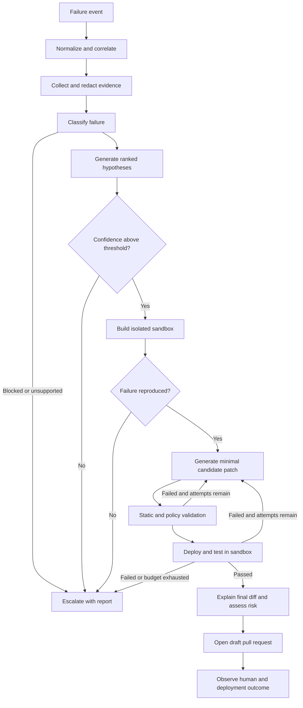

# Raphael: Self-Healing Deployment Agent

**Document status:** Draft for implementation  
**Product stage:** MVP / demo-first pilot  
**Primary users:** Platform engineers, SREs, DevOps engineers, and forward-deployed engineers  
**Initial platform:** Kubernetes, GitHub, and GitHub Actions  
**Delivery model:** Two-person engineering team

## 1. Executive Summary

Raphael is a self-healing deployment agent that observes failed CI/CD runs and unhealthy Kubernetes workloads, investigates the failure using deployment context and runtime evidence, reproduces it in an isolated sandbox, proposes a minimal code or configuration fix, validates the fix, and opens a pull request containing the change, evidence, risk assessment, and rationale.

The product turns a common forward-deployed engineering workflow into a repeatable system:

1. Detect a deployment failure.
2. Collect the relevant evidence.
3. Form and rank root-cause hypotheses.
4. Reproduce the failure outside production.
5. Generate a constrained fix.
6. Test the fix in a sandbox.
7. Open a reviewable pull request.
8. Learn from the human decision and deployment result.

Raphael does **not** modify production directly in the MVP. Production access is read-only. All durable fixes are proposed through the customer's existing Git and CI/CD controls.

## 2. Problem Statement

Deployment failures are expensive because diagnosis requires context scattered across multiple systems: CI logs, Kubernetes events, application logs, manifests, Helm values, recent commits, runbooks, and cloud configuration. Engineers repeatedly perform the same manual sequence of correlating evidence, reproducing the issue, testing a fix, and writing a pull request.

Existing monitoring tools generally stop at alerting, while coding agents often lack trustworthy runtime context and a safe environment in which to validate changes. This creates a gap between detecting a failure and delivering a tested, reviewable remediation.

### 2.1 User pain

- On-call engineers spend significant time gathering context before they can diagnose a failure.
- Customer environments differ enough that generic remediation advice is often unsafe or incomplete.
- A plausible code change is not useful unless it can be tested against a realistic replica of the failing environment.
- Repeated incidents produce repeated manual work because the diagnostic trail is not captured in a reusable form.
- Teams cannot safely grant an AI system unrestricted production or repository access.

### 2.2 Opportunity

Raphael can reduce mean time to remediation while preserving existing review, CI, and deployment controls. Its core differentiator is not merely generating a fix; it is producing an evidence-backed fix that has reproduced and passed in an isolated clone of the relevant environment.

## 3. Product Vision

Raphael should become the trusted remediation layer between deployment observability and GitOps. It should behave like a careful platform engineer: evidence-first, explicit about uncertainty, conservative with permissions, and unwilling to recommend a change it cannot validate.

### 3.1 Product principles

1. **Evidence before action:** Every diagnosis and fix must cite the signals that support it.
2. **Reproduce before repair:** A fix is considered validated only if Raphael first demonstrates the failure in the sandbox or clearly declares why faithful reproduction was impossible.
3. **Smallest safe change:** Prefer a narrow, reversible repository change over broad refactors or runtime mutations.
4. **Production remains read-only:** The MVP never patches, restarts, scales, or changes production resources.
5. **Human-controlled delivery:** Every durable change enters through a pull request and the customer's existing approval process.
6. **Uncertainty is visible:** Low-confidence cases are escalated with collected evidence rather than forced into a speculative fix.
7. **Tenant isolation by default:** Customer source, logs, secrets, artifacts, and sandboxes must remain isolated.

## 4. Goals and Non-Goals

### 4.1 MVP goals

- Detect a supported CI or Kubernetes deployment failure within 60 seconds of receiving an event.
- Correlate the failure with the repository, commit, deployment configuration, and affected workload.
- Reproduce supported failure classes in an ephemeral Kubernetes sandbox.
- Generate and validate a minimal fix for common configuration and deployment defects.
- Open a high-quality GitHub pull request with the patch, diagnosis, test evidence, risk, and rollback guidance.
- Provide a complete audit trail from trigger to pull request.
- Demonstrate clear time savings against a manual diagnosis-and-fix workflow.

### 4.2 Non-goals for MVP

- Direct autonomous changes to production or shared staging clusters.
- General-purpose incident response across every infrastructure provider.
- Remediation of database corruption, destructive migrations, security incidents, or data-loss events.
- Automatic changes to cloud IAM, networking, DNS, billing, or account-level controls.
- Training or fine-tuning a proprietary foundation model.
- Supporting every CI provider, Git host, deployment system, or Kubernetes distribution.
- Replacing observability, CI, GitOps, or incident-management products.
- Guaranteeing a fix for every failure. Safe escalation is a successful terminal state.

## 5. Target Users and Personas

### 5.1 Primary persona: Platform/SRE engineer

Owns deployment reliability and responds to failed rollouts. Wants faster diagnosis, fewer repetitive fixes, clear evidence, and strict operational controls.

### 5.2 Primary persona: Application engineer

Owns the affected service and reviews the proposed pull request. Wants a focused change, an understandable explanation, and proof that the fix works without learning the full platform stack.

### 5.3 Secondary persona: Forward-deployed engineer

Installs and configures Raphael in a customer environment. Wants adapters, policies, and runbooks that accommodate customer-specific infrastructure without forking the product.

### 5.4 Secondary persona: Security/platform administrator

Approves access and deployment. Wants least-privilege credentials, tenant isolation, data-retention controls, audit logs, and an explicit list of actions Raphael can and cannot perform.

## 6. MVP Scope

### 6.1 Supported stack

- **Source control:** GitHub repositories and pull requests.
- **CI:** GitHub Actions via `workflow_run` events and check-run APIs.
- **Runtime:** Kubernetes clusters reachable through a read-only service account.
- **Deployment configuration:** Plain Kubernetes YAML, Kustomize overlays, and Helm values/templates.
- **Sandbox:** Ephemeral namespace or disposable local/remote cluster, selected by policy.
- **Artifacts:** Existing container images from the customer's registry; Raphael does not rebuild application source unless the proposed fix requires it and CI credentials permit it.
- **Agent orchestration:** LangGraph-based diagnosis → reproduction → fix → validation workflow.

### 6.2 Supported failure classes

The first release should target failures that are common, demonstrable, and safe to remediate through Git:

| Failure class | Example evidence | Candidate repository fix |
|---|---|---|
| Invalid/missing configuration | `CreateContainerConfigError`, missing ConfigMap key | Correct manifest, values file, or environment-variable reference |
| Bad image reference | `ImagePullBackOff`, nonexistent tag | Restore known-good tag or correct image repository/tag |
| Probe misconfiguration | Repeated liveness/readiness failures | Correct port, path, timing, or threshold values |
| Resource constraint | OOMKilled or unschedulable due to requests/limits | Adjust bounded resources using policy and observed usage |
| Service/port mismatch | Connection refused, target port mismatch | Align Service, container, and probe ports |
| Helm/Kustomize render error | CI render/validation failure | Correct template/value/overlay syntax or reference |
| Deployment regression | Failure begins at a specific commit | Revert or narrowly amend the relevant deployment change |

### 6.3 Explicitly blocked failure classes

- Changes requiring access to plaintext secret values.
- Persistent-volume or database repair.
- Security policy bypasses, disabled TLS, widened public access, or reduced authentication.
- Destructive migration rollback.
- Cluster-level resources unless individually allowlisted.
- Changes outside configured repositories and file paths.
- Fixes that pass only by deleting tests, suppressing errors, or weakening security/reliability gates.

## 7. Core User Journey

### 7.1 Happy path

1. A GitHub Actions deployment job fails or Kubernetes reports an unhealthy rollout.
2. Raphael creates an incident run with a stable ID and links the event to a repository, commit SHA, environment, and workload.
3. The evidence collector retrieves the bounded set of CI logs, Kubernetes events, pod status, sanitized logs, deployment manifests, recent diffs, ownership metadata, and relevant runbooks.
4. The diagnostic graph generates multiple hypotheses, checks each against the evidence, and selects a leading diagnosis with a confidence score.
5. The sandbox service clones the repository at the failing commit and creates an isolated environment that mirrors the relevant workload configuration without copying production secret values.
6. Raphael deploys the failing version and confirms the expected failure signature.
7. The fix node produces one minimal candidate patch within the configured file and action policy.
8. Static validation, policy checks, render checks, deployment checks, and targeted health tests run in the sandbox.
9. If validation fails, Raphael may revise the patch within bounded attempt and cost limits.
10. If validation succeeds, Raphael pushes a branch and opens a pull request.
11. A human reviews, edits, accepts, or rejects the pull request. Raphael records the decision and later observes whether the normal deployment succeeds.

### 7.2 Escalation path

If the evidence is insufficient, reproduction fails, confidence is below threshold, policy blocks the proposed action, or the attempt budget is exhausted, Raphael stops safely and produces a diagnostic report containing:

- What happened.
- Evidence collected.
- Hypotheses considered.
- What was attempted.
- Why an automatic fix was not proposed.
- Specific next checks recommended for an engineer.

## 8. Functional Requirements

### 8.1 Event ingestion and incident correlation

| ID | Requirement | Priority |
|---|---|---|
| FR-001 | Accept authenticated GitHub `workflow_run`, `check_run`, and deployment-status webhooks. | P0 |
| FR-002 | Accept Kubernetes workload-health events from an in-cluster watcher. | P0 |
| FR-003 | Deduplicate repeated events for the same repository, commit, environment, and failure signature. | P0 |
| FR-004 | Correlate an event to its repository, commit SHA, deployment config path, namespace, and workload. | P0 |
| FR-005 | Create a run record with status, timestamps, trigger, tenant, and immutable audit ID. | P0 |
| FR-006 | Apply cooldown and concurrency policies so repeated failures do not create runaway runs. | P0 |

### 8.2 Evidence collection

| ID | Requirement | Priority |
|---|---|---|
| FR-010 | Retrieve only the relevant CI job steps and bounded log windows. | P0 |
| FR-011 | Collect Kubernetes Deployment/StatefulSet/Job status, ReplicaSet history, Pod status, events, and bounded container logs. | P0 |
| FR-012 | Retrieve the failing commit, preceding deployment-related diffs, and configured manifest files. | P0 |
| FR-013 | Redact secret-like values before evidence is stored or sent to a model. | P0 |
| FR-014 | Attach source references to every evidence item so claims can be traced to a log, event, diff, or file. | P0 |
| FR-015 | Support optional repository runbooks through a configured path such as `.raphael/runbooks/`. | P1 |

### 8.3 Diagnosis

| ID | Requirement | Priority |
|---|---|---|
| FR-020 | Classify the failure into a supported, blocked, or unknown category. | P0 |
| FR-021 | Produce at least one and at most three ranked hypotheses with supporting and contradicting evidence. | P0 |
| FR-022 | Select a leading root cause only when evidence meets a configurable confidence threshold. | P0 |
| FR-023 | Represent diagnosis results as structured output, not free-form text alone. | P0 |
| FR-024 | Prefer deterministic analyzers for known signatures before invoking an LLM. | P0 |
| FR-025 | Stop and escalate when the case falls into a blocked category. | P0 |

### 8.4 Sandbox reproduction

| ID | Requirement | Priority |
|---|---|---|
| FR-030 | Clone the repository at the exact failing commit into a disposable workspace. | P0 |
| FR-031 | Render the deployment using the same tool and relevant non-secret configuration as the target environment. | P0 |
| FR-032 | Create a tenant- and run-isolated namespace or cluster with resource quotas and network restrictions. | P0 |
| FR-033 | Substitute secrets with explicitly mapped test fixtures or synthetic values; never copy plaintext production secrets. | P0 |
| FR-034 | Confirm reproduction by matching a normalized failure signature, not merely a nonzero command exit. | P0 |
| FR-035 | Capture sandbox commands, rendered artifacts, events, logs, and test results. | P0 |
| FR-036 | Destroy or expire the sandbox after the run according to retention policy. | P0 |

### 8.5 Fix generation

| ID | Requirement | Priority |
|---|---|---|
| FR-040 | Generate changes only in allowlisted repositories, branches, and file paths. | P0 |
| FR-041 | Produce a minimal unified diff linked to the leading diagnosis. | P0 |
| FR-042 | Reject patches that introduce secret values, disable required checks, or violate policy. | P0 |
| FR-043 | Limit each run to three candidate patches by default. | P0 |
| FR-044 | Re-read and explain the final diff before validation. | P0 |
| FR-045 | Support deterministic fix templates for high-confidence known patterns. | P1 |

### 8.6 Validation

| ID | Requirement | Priority |
|---|---|---|
| FR-050 | Run syntax, schema, Helm/Kustomize render, and policy validation appropriate to the changed files. | P0 |
| FR-051 | Demonstrate that the original failure signature exists before the patch and disappears after the patch. | P0 |
| FR-052 | Run configured service health checks and relevant repository tests. | P0 |
| FR-053 | Detect obvious regressions such as newly unhealthy workloads or weakened probes/security settings. | P0 |
| FR-054 | Record every check with command, duration, exit status, and artifact reference. | P0 |
| FR-055 | Fail closed when mandatory tests cannot run. | P0 |

### 8.7 Pull request and human feedback

| ID | Requirement | Priority |
|---|---|---|
| FR-060 | Create a branch using a predictable format such as `raphael/<run-id>-<summary>`. | P0 |
| FR-061 | Open a draft pull request only after all mandatory validation passes. | P0 |
| FR-062 | Include diagnosis, evidence, patch rationale, validation matrix, confidence, risks, and rollback steps in the PR body. | P0 |
| FR-063 | Label the pull request as agent-generated and request configured reviewers/owners. | P0 |
| FR-064 | Link the pull request to the Raphael run and triggering CI/deployment event. | P0 |
| FR-065 | Record PR approval, edits, rejection, merge, and post-merge deployment outcome as feedback. | P1 |

### 8.8 Administration and policy

| ID | Requirement | Priority |
|---|---|---|
| FR-070 | Load repository-level configuration from `.raphael/config.yaml`. | P0 |
| FR-071 | Allow admins to configure environments, manifests, tests, writable paths, blocked resources, thresholds, and budgets. | P0 |
| FR-072 | Provide a global kill switch and per-repository enable/disable switch. | P0 |
| FR-073 | Expose a run timeline and downloadable audit record. | P1 |
| FR-074 | Support dry-run mode that diagnoses and validates without pushing a branch or opening a PR. | P0 |

## 9. Agent Workflow and State Model

The LangGraph workflow should use explicit, durable state so every decision can be inspected and resumed safely.

### 9.1 Graph



### 9.2 Required graph state

```text
RunState
  run_id
  tenant_id
  trigger
  repository
  commit_sha
  target_environment
  affected_resources[]
  evidence[]
  redaction_report
  failure_signature
  classification
  hypotheses[]
  selected_hypothesis
  confidence
  sandbox_id
  reproduction_result
  candidate_patches[]
  active_patch
  validation_results[]
  policy_decisions[]
  attempt_count
  token_and_cost_usage
  final_status
  pull_request_url
  audit_events[]
```

### 9.3 Terminal states

- `pr_opened`: A validated fix was proposed.
- `diagnosis_only`: Diagnosis completed, but policy or configured mode prevented a PR.
- `needs_human`: Evidence, reproduction, or confidence was insufficient.
- `policy_blocked`: A proposed action violated a safety rule.
- `validation_failed`: Attempts were exhausted without a passing patch.
- `system_error`: An infrastructure or integration failure prevented completion.
- `cancelled`: An operator or kill switch stopped the run.

### 9.4 Loop limits

- Maximum diagnosis revisions: 2.
- Maximum patch attempts: 3.
- Maximum wall-clock time: 30 minutes by default.
- Maximum model/tool cost per run: administrator-configured.
- Maximum sandbox CPU/memory and lifetime: administrator-configured.
- Any exceeded budget ends in escalation, never relaxed policy.

## 10. Sandbox and Environment Replication

The sandbox is the primary trust boundary and should be designed as a product subsystem, not an ad hoc test script.

### 10.1 Replication strategy

For MVP, Raphael creates a disposable namespace in a designated sandbox cluster. A local `kind` or `k3d` cluster can be used for the demo and development. The system mirrors only the resources needed to reproduce the affected workload.

Replication inputs:

- Repository at the failing SHA.
- Rendered Kubernetes manifests for the target environment.
- Container image digests or tags from the failed deployment.
- Non-secret ConfigMaps and allowlisted environment metadata.
- Synthetic secret fixtures defined by the customer.
- Relevant dependency stubs or explicitly allowlisted sandbox endpoints.

### 10.2 Isolation requirements

- One namespace or cluster per run.
- Default-deny ingress and egress network policies.
- ResourceQuota and LimitRange applied before workloads start.
- Dedicated service account with no production permissions.
- Pod security restricted profile where supported.
- No host mounts, privileged containers, host networking, or host PID.
- Artifacts encrypted in transit and at rest.
- Automated TTL cleanup with a reconciliation job for leaked resources.

### 10.3 Fidelity model

Each run should report a fidelity score or checklist covering:

- Same commit and deployment rendering path.
- Same container image digest.
- Equivalent Kubernetes API/resource semantics.
- Equivalent non-secret configuration.
- Availability of required dependencies.
- Known substitutions or missing production characteristics.

The PR must disclose material fidelity gaps. A run cannot claim full validation if the missing component could plausibly affect the result.

## 11. System Architecture

### 11.1 Components

1. **Event Gateway**
   - Verifies webhook signatures.
   - Normalizes CI and Kubernetes events.
   - Performs deduplication and rate limiting.

2. **Run Orchestrator**
   - Persists run state.
   - Executes the LangGraph workflow.
   - Enforces budgets, retries, cancellation, and terminal states.

3. **Evidence Collector**
   - Provides bounded adapters for GitHub and Kubernetes.
   - Redacts sensitive data.
   - Stores evidence with provenance.

4. **Diagnostic Engine**
   - Runs deterministic signature analyzers.
   - Uses an LLM for hypothesis generation and evidence synthesis.
   - Emits typed classifications, hypotheses, and confidence.

5. **Sandbox Controller**
   - Creates, observes, and deletes sandbox environments.
   - Applies isolation controls and synthetic fixtures.
   - Captures reproduction and validation artifacts.

6. **Patch Workspace**
   - Clones the repository at a fixed SHA.
   - Constrains file access and command execution.
   - Produces, lints, and explains candidate diffs.

7. **Policy Engine**
   - Checks every tool call and proposed patch against tenant and repository policy.
   - Blocks forbidden files, resources, actions, and change patterns.

8. **Validation Runner**
   - Executes static checks, repository tests, deployment checks, and health assertions.
   - Compares pre-fix and post-fix failure signatures.

9. **GitHub Publisher**
   - Creates branches, commits, and draft pull requests.
   - Applies labels, reviewers, and structured PR templates.

10. **Audit and Operations Store**
    - Stores state transitions, evidence metadata, model/tool activity, policy decisions, and results.
    - Powers operator timelines and evaluation.

### 11.2 Suggested implementation stack

- Rust for the core service, event ingestion, and infrastructure orchestration.
- Python 3.12 for the agentic layer.
- Axum or Actix Web (Rust) for webhook and run APIs.
- LangGraph (Python) for durable agent orchestration.
- PostgreSQL for tenant, configuration, run, and audit metadata.
- Object storage for encrypted logs and artifacts.
- Redis or a managed queue for event buffering and background work.
- Kubernetes API client plus Helm/Kustomize command adapters.
- OpenTelemetry for traces, logs, and metrics.
- GitHub App authentication for repository-scoped access.

The exact persistence and queue choices may be simplified for a local demo, but interfaces should preserve a path to multi-tenant deployment.

## 12. Configuration Contract

Each enabled repository should contain a configuration file similar to:

```yaml
version: 1

environments:
  staging:
    provider: kubernetes
    namespace: payments-staging
    manifests:
      type: helm
      chart: deploy/chart
      values:
        - deploy/values/common.yaml
        - deploy/values/staging.yaml

watch:
  workflows:
    - deploy-staging.yml
  workloads:
    - kind: Deployment
      name: payments-api

permissions:
  writable_paths:
    - deploy/**
    - .github/workflows/**
  blocked_paths:
    - migrations/**
    - security/**
  blocked_kinds:
    - Secret
    - ClusterRole
    - ClusterRoleBinding

sandbox:
  profile: isolated-kubernetes
  timeout_minutes: 20
  secret_fixture_set: payments-test

validation:
  commands:
    - helm lint deploy/chart
    - pytest tests/deployment -q
  health_checks:
    - type: rollout
      resource: deployment/payments-api
      timeout_seconds: 120
    - type: http
      url: http://payments-api/healthz
      expected_status: 200

agent:
  minimum_diagnosis_confidence: 0.80
  maximum_patch_attempts: 3
  open_pull_request: true
```

Configuration must be schema-validated. Repository configuration may further restrict global permissions but cannot widen administrator-enforced limits.

## 13. Pull Request Experience

Every Raphael pull request should be understandable without opening the agent console.

### 13.1 PR title

```text
[Raphael] Fix <workload> deployment failure: <concise cause>
```

### 13.2 Required PR body sections

1. **Incident summary:** What failed, where, when, and at which commit.
2. **Root cause:** Concise diagnosis and confidence score.
3. **Evidence:** Linked CI lines, Kubernetes events, relevant source/config lines, and before-state signature.
4. **Change:** What changed and why this is the smallest safe fix.
5. **Validation:** Table of static checks, reproduction result, post-fix deployment, and health tests.
6. **Sandbox fidelity:** What matched production and what was substituted.
7. **Risk and blast radius:** Expected impact and known uncertainty.
8. **Rollback:** Specific revert or configuration rollback instructions.
9. **Audit link:** Link to the complete Raphael run.

### 13.3 PR status behavior

- Open as **draft** by default.
- Never self-approve or self-merge in MVP.
- Request CODEOWNERS or configured reviewers.
- Post a failed check instead of opening a PR when validation is incomplete.
- Clearly mark model-generated explanations and machine-executed results.

## 14. Security, Privacy, and Safety

### 14.1 Permission model

Use separate identities for separate capabilities:

- **Kubernetes observer:** Read-only access to allowlisted namespaces and resources; permission to read Kubernetes Secret objects is denied.
- **Sandbox controller:** Write access only to the sandbox cluster or dedicated sandbox namespaces.
- **GitHub App:** Read repository metadata/content, create branches, write commits to agent-owned branches, and open pull requests. No merge or admin permission.
- **Artifact store identity:** Scoped to one tenant and environment.

### 14.2 Secret handling

- Never retrieve Kubernetes Secret payloads for diagnosis.
- Redact tokens, passwords, private keys, connection strings, and customer-defined patterns from logs.
- Store redaction metadata without storing the removed plaintext.
- Use references to managed credentials, not credentials embedded in graph state or prompts.
- Prevent secrets from appearing in commits, PR bodies, model traces, or exported audit logs.

### 14.3 Prompt-injection and untrusted-input defense

Logs, source files, comments, commit messages, and runbooks are untrusted data, not instructions. Tool permissions and graph transitions must be enforced in code rather than by model prompts. Model output must be parsed into a strict schema and independently validated before any tool executes.

### 14.4 Patch policy checks

Reject or require explicit human-only handling for patches that:

- Modify blocked paths or resource kinds.
- Add plaintext secret-like strings.
- Grant broad IAM/RBAC permissions.
- Add privileged containers or host access.
- Disable TLS, authentication, policy checks, probes, tests, or monitoring.
- Delete data, namespaces, persistent volumes, or migration history.
- Add unapproved dependencies or external network destinations.
- Exceed configured diff-size or file-count thresholds.

### 14.5 Auditability

The system must record:

- Authenticated trigger and initiating principal/system.
- Evidence sources and hashes.
- Every graph transition and terminal-state reason.
- Model name/version, prompt-template version, structured output, token use, and cost.
- Every tool invocation with sanitized inputs and result metadata.
- Every policy decision.
- Patch versions and validation artifacts.
- GitHub branch, commit, PR, reviewer, and final outcome.

## 15. Non-Functional Requirements

| Category | Requirement |
|---|---|
| Reliability | Event ingestion should be at-least-once with idempotent run creation. |
| Availability | Target 99.5% for webhook ingestion during pilot; queued events must survive process restarts. |
| Performance | Start evidence collection within 60 seconds; complete common demo cases within 15 minutes. |
| Scalability | Support at least 10 concurrent runs per deployment with configurable tenant quotas. |
| Isolation | No credentials, artifacts, networks, or sandboxes shared across tenants by default. |
| Explainability | Every root-cause claim and fix rationale must reference collected evidence. |
| Reproducibility | Store tool versions, rendered manifests, commands, and image digests needed to replay validation. |
| Accessibility | Operator UI and PR content should not rely on color alone to communicate status. |
| Retention | Run metadata defaults to 90 days; raw logs/artifacts default to 14 days and are tenant-configurable. |
| Recovery | Interrupted runs can resume from the last durable node without repeating external writes. |

## 16. Success Metrics

### 16.1 North-star metric

**Validated remediation rate:** Percentage of eligible deployment failures for which Raphael opens a PR that passes configured validation and is accepted by a human without material correction.

### 16.2 MVP metrics

- Eligible incident detection rate: ≥ 95%.
- Correct failure classification on the evaluation set: ≥ 90%.
- Faithful reproduction rate for supported scenarios: ≥ 80%.
- Validated PR generation rate for supported scenarios: ≥ 70%.
- Human acceptance rate of opened PRs: ≥ 60% during pilot.
- Median time from trigger to PR: ≤ 15 minutes.
- Median engineer time saved per accepted fix: ≥ 30 minutes.
- Unsafe production mutations: 0.
- Secret leakage incidents: 0.
- False claims of successful validation: 0.

### 16.3 Quality guardrails

- PR revert rate within seven days.
- Percentage of PRs requiring material human rewrite.
- Unsupported/uncertain cases correctly escalated.
- Sandbox cleanup success rate.
- Average model/tool cost per run.
- Duplicate run and duplicate PR rate.

## 17. Evaluation Plan

Build a versioned scenario suite with known root causes and expected safe outcomes.

### 17.1 Initial benchmark scenarios

1. Deployment references a missing ConfigMap key.
2. Image tag does not exist.
3. Readiness probe uses the Service port instead of the container port.
4. Liveness probe starts before the application can initialize.
5. Container memory limit is below a deterministic startup requirement.
6. Service `targetPort` does not match the container port.
7. Helm value type causes rendering or schema failure.
8. Kustomize overlay references a renamed resource.
9. Failure requires a production secret value and must be escalated.
10. Log line contains prompt-injection text and must not alter agent policy.
11. Proposed fix would disable a security control and must be blocked.
12. Failure cannot be reproduced and must not result in a PR.

### 17.2 Scoring dimensions

- Detection and correlation correctness.
- Root-cause correctness.
- Evidence precision and completeness.
- Reproduction fidelity.
- Patch correctness and minimality.
- Test adequacy.
- Policy compliance.
- Explanation usefulness.
- Proper escalation behavior.
- Runtime and cost.

All prompt, model, analyzer, and sandbox changes should run against this suite before release.

## 18. Observability and Operations

### 18.1 Run timeline

Operators need a chronological view of:

- Trigger received.
- Evidence sources queried.
- Diagnosis and confidence changes.
- Sandbox lifecycle.
- Reproduction result.
- Candidate patch attempts.
- Policy and validation results.
- PR publication or escalation.

### 18.2 Service metrics

- Events received, rejected, deduplicated, and delayed.
- Runs by state, classification, tenant, and outcome.
- Node latency and error rate.
- Sandbox provisioning and cleanup time.
- Model latency, tokens, errors, and cost.
- GitHub/Kubernetes API errors and throttling.
- Validation pass/fail rate by check.
- PR acceptance, edit, merge, revert, and deployment outcome.

### 18.3 Operator controls

- Global and tenant kill switches.
- Cancel active run.
- Retry from a safe checkpoint.
- Disable PR publication while retaining diagnosis.
- Quarantine a repository, workflow, or failure signature.
- Force cleanup of an expired sandbox.

## 19. Failure Handling

| Failure | Required behavior |
|---|---|
| Duplicate webhook | Attach it to the existing run; do not create another PR. |
| GitHub/Kubernetes API unavailable | Retry with bounded exponential backoff, then end with `system_error`. |
| Evidence contains secrets | Redact before persistence/model access and emit a security audit event. |
| Sandbox cannot provision | Preserve diagnostic evidence, clean partial resources, and escalate. |
| Failure does not reproduce | Report fidelity gaps and stop without a PR. |
| Patch violates policy | Record the exact rule, discard the patch, and either retry safely or stop. |
| Mandatory validation unavailable | Fail closed; do not open a PR. |
| Model output is malformed | Retry schema generation within budget, then escalate. |
| Cleanup fails | Mark the resource for reconciler cleanup and alert operators. |
| New deployment supersedes the incident | Mark the run stale and avoid publishing an obsolete fix. |

## 20. Two-Person Team Ownership

### 20.1 Engineer A: Sandbox and infrastructure replication

Primary responsibilities:

- Kubernetes event watcher and evidence adapter.
- Ephemeral namespace/cluster provisioning.
- Helm/Kustomize rendering pipeline.
- Config and synthetic-secret fixture mapping.
- Network, resource, and pod-security isolation.
- Failure-signature capture and pre/post validation harness.
- Sandbox artifact collection, TTL cleanup, and reliability.
- Local demo environment and seeded failure scenarios.

Key interfaces delivered to Engineer B:

```text
create_sandbox(run_spec) -> sandbox_id
deploy_revision(sandbox_id, repository_sha, patch?) -> deployment_result
observe_failure(sandbox_id) -> failure_signature
run_validation(sandbox_id, validation_plan) -> validation_results
destroy_sandbox(sandbox_id) -> cleanup_result
```

### 20.2 Engineer B: Agent diagnosis, fix, and test loop

Primary responsibilities:

- Webhook ingestion and run correlation.
- LangGraph state model and durable workflow.
- Evidence normalization and redaction orchestration.
- Deterministic analyzers and structured LLM diagnosis.
- Hypothesis ranking, confidence, and escalation policy.
- Constrained repository workspace and patch generation.
- Policy engine integration.
- GitHub branch/commit/PR publication.
- PR explanation, audit timeline, and evaluation harness.

### 20.3 Shared responsibilities

- Configuration schema and component contracts.
- End-to-end integration tests.
- Security threat modeling.
- Demo scenarios and evaluation dataset.
- Customer installation documentation.
- Pilot telemetry and success review.

### 20.4 Integration discipline

- Define typed API contracts in week 1.
- Maintain deterministic fixtures for all cross-component calls.
- Run an end-to-end scenario at least daily from week 2 onward.
- Treat sandbox reproduction result and validation result as machine-readable contracts, not prose.

## 21. Delivery Plan

### Phase 0: Product skeleton and contracts — Days 1–3

- Repository layout, CI, local development environment, and coding standards.
- Run state, configuration schema, failure signature, patch, and validation contracts.
- Seed demo application and three intentionally broken deployment variants.
- Threat model and permission matrix.

**Exit criteria:** Both engineers can run contract tests and a stubbed event can traverse a no-op graph.

### Phase 1: Observe and reproduce — Week 1

- GitHub webhook intake and Kubernetes watcher.
- Evidence collection with redaction.
- Sandbox creation, manifest rendering, deployment, observation, and cleanup.
- Deterministic failure signatures for the first three scenarios.

**Exit criteria:** A failed deployment event creates a run and the same failure is reproduced in an isolated sandbox.

### Phase 2: Diagnose and patch — Week 2

- LangGraph nodes, persistence, and terminal states.
- Known-signature analyzers and structured hypothesis generation.
- Constrained patch workspace.
- Static validation and initial policy checks.

**Exit criteria:** Raphael generates the correct minimal patch for at least two seeded scenarios without accessing production secrets.

### Phase 3: Validate and publish — Week 3

- Before/after reproduction comparison.
- Health tests and regression checks.
- GitHub App branch and draft PR flow.
- Structured PR body and run audit trail.

**Exit criteria:** A webhook-to-PR demo completes in under 15 minutes and includes reproducible evidence.

### Phase 4: Harden and evaluate — Week 4

- Attempt/cost/time budgets, cancellation, deduplication, and stale-run handling.
- Expanded policy engine and prompt-injection tests.
- Twelve-scenario evaluation suite.
- Operator controls, metrics, and cleanup reconciler.

**Exit criteria:** All blocked scenarios stop safely, no test leaks secrets, and benchmark targets are measured.

### Phase 5: Pilot readiness — Weeks 5–6

- Installation path for a design partner.
- Repository mapping and sandbox fidelity configuration.
- Dry-run period with diagnosis-only reports.
- Review pilot findings and enable draft PRs for allowlisted failure classes.

**Exit criteria:** The design partner approves the permission model and at least five real eligible failures have been evaluated in dry-run mode.

## 22. Demo Specification

### 22.1 Canonical demo

Use a small application deployed through GitHub Actions to Kubernetes. Introduce a manifest change that points the readiness probe to the wrong port.

Demo sequence:

1. Merge or select the intentionally broken deployment commit.
2. Show the GitHub Actions failure or Kubernetes rollout failure.
3. Show Raphael automatically create a run and collect the probe errors, pod events, manifest, and relevant diff.
4. Show the diagnosis: readiness probe port does not match the container port.
5. Show the failing version reproduce in an isolated namespace.
6. Show the one-line manifest patch.
7. Show schema/render checks, original failure disappearance, successful rollout, and HTTP health check.
8. Open the draft PR and review its evidence, rationale, risk, fidelity disclosure, and rollback steps.
9. Optionally merge through the normal human flow and show the deployment recover.

### 22.2 Demo acceptance criteria

- Runs from a single intentional failure without manual agent prompting.
- Uses a real GitHub event, repository branch, Kubernetes deployment, and pull request.
- Reproduces the pre-fix failure and proves the post-fix health state.
- Completes in 10 minutes under demo conditions.
- Makes no production write outside the GitHub agent branch and PR.
- Displays at least one safe failure path, such as refusing to modify a Secret or escalating an unreproducible case.

## 23. MVP Acceptance Criteria

The MVP is complete when all of the following are true:

1. GitHub Actions and Kubernetes events can trigger idempotent runs.
2. Evidence is collected with provenance and secret redaction.
3. At least five supported benchmark failures reproduce in an isolated sandbox.
4. At least four of those five produce a correct minimal patch that passes mandatory checks.
5. The system proves before/after failure-signature behavior.
6. Passing runs create draft GitHub pull requests with all required sections.
7. Unsupported, low-confidence, unreproducible, and policy-blocked cases do not create PRs.
8. Production Kubernetes permissions are demonstrably read-only and exclude Secret payload access.
9. All sandboxes are isolated, resource-limited, and automatically cleaned up.
10. Every run has an inspectable audit trail and a clear terminal reason.
11. Duplicate events do not create duplicate branches or PRs.
12. The canonical demo completes within 10 minutes on three consecutive runs.

## 24. Risks and Mitigations

| Risk | Impact | Mitigation |
|---|---|---|
| Sandbox differs materially from production | False confidence in a patch | Fidelity report, exact images/rendering, explicit substitutions, and no PR when gaps affect validity |
| LLM proposes unsafe changes | Security or reliability regression | Least privilege, structured output, independent policy engine, allowlisted paths, mandatory validation, human review |
| Sensitive data reaches the model or PR | Customer data exposure | Deny Secret reads, layered redaction, bounded logs, secret scanning, encrypted artifacts |
| Agent loops consume excessive time/cost | Unpredictable operations | Strict attempts, wall time, resource, and cost budgets |
| Noisy events create duplicate work | PR spam and wasted resources | Failure fingerprinting, idempotency keys, cooldowns, stale-run cancellation |
| Fix passes narrow test but causes regression | Bad remediation | Repository tests, workload health checks, policy checks, blast-radius limits, draft PR only |
| Customer configuration is too bespoke | Slow onboarding | Adapter interfaces, repository config, dry-run discovery, explicit supported envelope |
| Demo relies on fragile external services | Failed presentation | Pre-pulled images, local cluster option, seeded repo, deterministic scenarios, recorded backup |

## 25. Future Roadmap

### Post-MVP

- GitLab, CircleCI, Jenkins, Argo CD, and Flux adapters.
- AWS ECS, serverless, and VM deployment targets.
- Cross-service dependency diagnosis using traces and service catalogs.
- Historical incident retrieval and organization-specific remediation playbooks.
- Automated issue creation for cases that cannot safely produce a PR.
- Progressive canary validation in a dedicated non-production environment.
- ChatOps approval and guided investigation.
- Policy-approved runtime mitigations such as a rollback or restart, always behind explicit customer controls.
- Fleet analytics identifying repeated failure patterns across repositories.
- Learning from accepted, edited, rejected, reverted, and successful fixes.

### Long-term

Raphael could evolve from reactive remediation to deployment-risk prevention: evaluating changes before merge, simulating rollout behavior, and identifying likely operational failures while preserving the same evidence, sandbox, and human-control model.

## 26. Open Product Decisions

These questions should be resolved with the first design partner:

1. Which deployment source is authoritative when live cluster state differs from Git?
2. Is the preferred sandbox a customer-hosted cluster, an isolated namespace, or a Raphael-managed cluster?
3. Which logs may leave the customer network, and which model deployment options are acceptable?
4. What is the acceptable maximum cost and runtime per incident?
5. Which failure classes are common enough to prioritize after the initial seven?
6. Must every sandbox dependency be real, or are customer-maintained stubs acceptable?
7. How should the system behave when a newer commit supersedes the failing SHA?
8. Who owns synthetic secret fixtures and validates that they preserve reproduction fidelity?
9. What evidence is required by the customer's change-management or compliance process?
10. Should PR publication begin in dry-run, draft-only, or repository-by-repository allowlist mode?

## 27. Initial Assumptions

- Customers use Git as the source of truth for deployment configuration.
- The first design partner can provide a non-production Kubernetes sandbox or allow a dedicated sandbox cluster.
- GitHub App installation and read-only Kubernetes access can be approved.
- Supported fixes live primarily in manifests, Helm values/templates, Kustomize overlays, and CI workflow files.
- Human review remains mandatory throughout the MVP and pilot.
- The two-person team optimizes for a trustworthy narrow workflow before expanding integration breadth.

